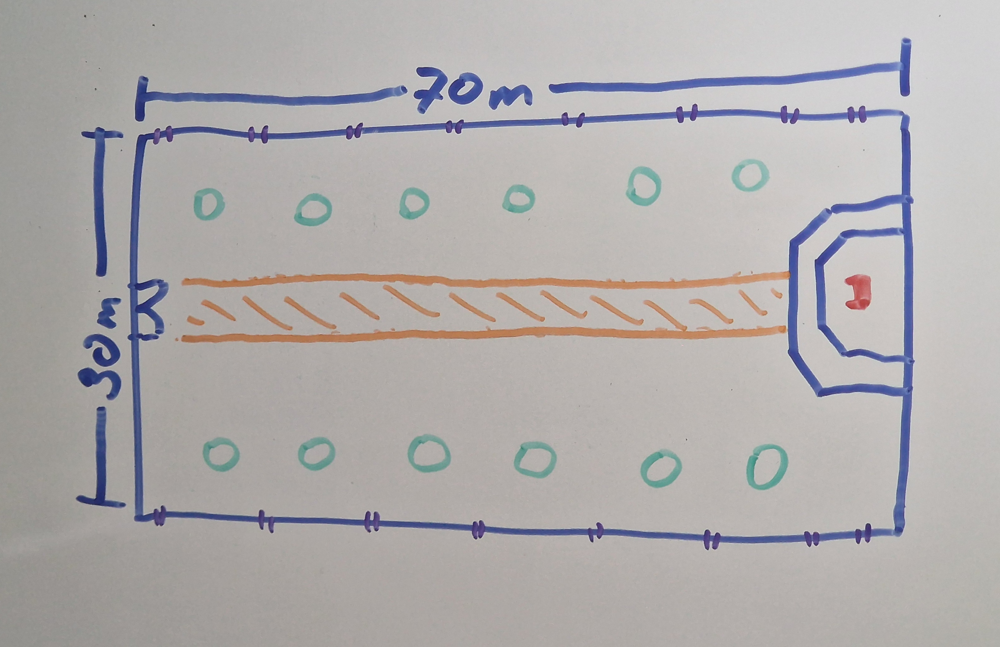

# Teilaufgabe Peißl
\textauthor{Nevio Peißl}

Dieser Teil der Diplomarbeit beschäftigt sich mit der Erstellung des Bossraum-Modells, der Benutzeroberfläche (UI) sowie der Cutscenes. Dabei werden die getroffenen Designentscheidungen sowie deren Umsetzung beschrieben.

## Literaturrecherche

In diesem Kapitel werden die theoretischen Grundlagen für die Erstellung von 3D-Modellen, Benutzeroberflächen und Cutscenes, die für das Spiel "ConquerTheCastle" benötigt werden, behandelt.

### Blender

Blender ist ein Open-Source-3D-Programm, das von der Blender Foundation entwickelt wird und kostenlos zugänglich ist. Es deckt alle wesentlichen Schritte der 3D-Modellierung ab. Dazu zählen Modeling, Animation, Simulation, Rendering und Export. Dadurch ist es möglich, den gesamten 3D-Workflow innerhalb von Blender durchzuführen, ohne zusätzliche externe Software zu verwenden. [@blender_features]

Die Mission von Blender ist es, ein leistungsstarkes 3D-Programm für jeden frei zugänglich zu machen. Blender wird von einer großen Community entwickelt, wobei jeder einen Beitrag leisten kann. [@blender_about]

Blender ist für diese Arbeit eine optimale Lösung, da es frei verfügbar, leistungsstark und durch eine große, aktive Community unterstützt wird. Zudem gibt es zahlreiche frei zugängliche Online-Tutorials und umfangreiche Dokumentationen. Die Software erhält regelmäßig Updates und wird kontinuierlich erweitert. Blender ist auf den gängigen Betriebssystemen (Linux, Windows und macOS) verfügbar und basiert auf OpenGL. [@blender_manual]

#### Koordinatensystem

Beim Erstellen eines neuen Blender-Projekts ist zunächst nur das Koordinatensystem sichtbar. Dieses besteht aus drei Achsen: X, Y und Z. Die Achsen erstrecken sich jeweils vom positiven bis zum negativen Bereich und treffen sich im Nullpunkt. Sie dienen als Orientierungshilfe und bieten dem Benutzer einen festen Bezugspunkt innerhalb der Szene. Zusätzlich befindet sich rechts oben ein kleines Achsendiagramm, das die Orientierung des Nutzers in Echtzeit anzeigt (siehe Abb. 1). [@blender_manual]

![Koordinatensystem [@blender]](img/peissl/theorie/koordinatensystem.png){width=90%}

Die Kamera kann mit dem Mausrad rotiert und mit Shift + Mausrad verschoben werden. [@blender_manual]

Der 3D-Cursor, der in Abb. 1 sichtbar ist, definiert die Position, an der neue Objekte hinzugefügt werden. Standardmäßig befindet er sich im Nullpunkt und kann mit Shift + rechter Maustaste frei im 3D-Raum verschoben werden. Wird der Cursor versetzt, ändert sich entsprechend die Einfügeposition neuer Objekte. Mit Shift + C kann der Cursor wieder auf den Nullpunkt zurückgesetzt werden. [@blender_manual]

#### Primitive Objekte

Blender bietet mehrere primitive Basisobjekte, die mithilfe der Tastenkombination Shift + A eingefügt werden können. Dazu zählen unter anderem der Würfel, der Zylinder oder die Kugel (siehe Abb. 2). Diese Objekte besitzen typische Anwendungsfälle: Für Gebäude wird häufig ein Würfel verwendet, während sich ein Zylinder besonders für Säulen eignet. [@blender_manual]

Wird ein Objekt ausgewählt, ist es orange umrandet. Der Ursprung des Objekts wird sichtbar, und das Objekt wird im Outliner auf der rechten Seite markiert (siehe Abb. 2, Zylinder). [@blender_manual]

![Objekte [@blender]](img/peissl/theorie/objekte.png){width=90%}

Objekte bestehen aus Vertices, Edges und Faces. Ein Vertex stellt einen einzelnen Punkt dar. Werden zwei Vertices verbunden, entsteht eine Edge. Mehrere verbundene Edges ergeben eine Face. Verbinden sich mehrere Faces, entsteht ein Mesh, welches das eigentliche Objekt darstellt. [@blender_manual]

Diese Objekte werden verändert, um das gewünschte Ergebnis zu erzielen. Objekte können verschoben (`G`), rotiert (`R`) und skaliert (`S`) werden. Wenn ein Objekt verschoben wird und dazu eine Achse (X, Y oder Z) ausgewählt wird, verschiebt sich das Objekt nur auf dieser Achse. Wenn ein Objekt genau einen Meter nach X positiv verschoben werden sollte, lautet der Befehl `G + X + 1`. [@blender_manual]

#### Bearbeitungsmodi

##### Object Mode

Der Object Mode ist der Standardmodus in Blender. In diesem Modus können Objekte eingefügt, gruppiert, verschoben, skaliert und rotiert werden. Er dient der Anordnung von Objekten innerhalb der Szene. Die Geometrie der Objekte kann in diesem Modus nicht verändert werden. Der Object Mode ist essenziell, um den Überblick über die gesamte Szene zu behalten. [@blender_manual]

##### Edit Mode

Im Edit Mode bearbeitet man die Geometrie einzelner Objekte. Um in den Edit Mode zu kommen muss man das Objekt auswählen und `Tab` drücken. Ein weiteres `Tab` und man gelangt wieder im Object Mode. Wichtige Edit Mode Tools sind Extrude `E`, Insert `I`, Loop Cut `Ctrl + R`, Bevel `B` und Merge Vertices `M`. Mit den Tasten `1`, `2` und `3` kann zwischen der Auswahl von Vertices, Edges und Faces gewechselt werden. [@blender_manual]

#### Mirror
Der Mirror Modifier spiegelt ein Objekt entlang einer oder mehrerer Achsen, wobei die Spiegelung über den Objektursprung erfolgt. Dieser Modifier reduziert den Arbeitsaufwand bei symmetrischen Modellen erheblich und stellt sicher, dass beide Seiten exakt identisch sind. [@blender_manual]

#### Solidify
Der Solidify Modifier verleiht Objekten eine Dicke. Die einfachste Anwendung ähnelt dem Extrude-Werkzeug im Edit Mode. Die Dicke kann im Modifier-Tab über den Parameter Thickness eingestellt werden. Zusätzliche Optionen ermöglichen eine weitere Anpassung des Ergebnisses. Die Einstellung Even Thickness sorgt für eine gleichmäßige Dicke an allen Kanten, während Fill Rim offene Kanten schließt und Hohlräume verhindert. [@blender_manual]

#### Extra Mesh Objects

Extra Mesh Objects ist ein Add-on für Blender, das die dynamische Erstellung komplexer Strukturen wie Wände ermöglicht. Um es zu nutzen, muss das Add-on installiert sein. Neue Wall Objekte werden mit `Shift + A` und dem Wall Builder erstellt (siehe Abb. 3). [@blender_extra_mesh_objects]

![Wall Builder [@blender]](img/peissl/theorie/wallbuilder.png){width=90%}

Es können nun die Eigenschaften dieser Wand bearbeitet werden. Darunter zählen Anfang und Ende der Wand, die Höhe und Breite sowie die Größe der einzelnen Ziegelsteine. Es gibt noch weitere Einstellungen für Fenster, Zinnen und Treppen. [@blender_extra_mesh_objects]

#### UV-Mapping

UV-Mapping wird zum Texturieren von Objekten benötigt. Es ist der Prozess, bei dem eine 3D-Grafik auf eine 2D-Fläche projiziert wird. Das Objekt wird aufgeschnitten und auf eine 2D Textur gelegt. Jede Fläche (Face) bekommt Koordinaten auf einer 2D-Textur. Wenn diese Textur bearbeitet wird, verändert sich auch das Aussehen des Objektes. Ohne UV-Mapping wären Texturen verzerrt, und Details gehen verloren. [@uv_mapping_guide] [@gpt_uv_mapping]

![UV Mapping [@uv_mapping_guide]](img/peissl/theorie/uv-mapping.png){width=90%}

#### Low-Poly-Modellierung

Durch die geringe Anzahl von Polygonen bleibt der Rechenaufwand eher gering und die Framerate ist stabiler. Außerdem verkürzen sich Ladezeiten, besonders auf älteren Geräten. Low-Poly hält den Style einheitlich und reduziert den Modellierungsaufwand drastisch. Ein Low-Poly Spiel setzt nicht auf hochauflösende Grafik oder komplexe Modelle, sondern auf die Einfachheit und Effizienz. [@low_poly] [@why_low_poly]

![Low-Poly Beispiel [@low_poly_example]](img/peissl/theorie/low-poly-example.png){width=90%}

#### Exportformat

Blender unterstützt das Exportformat FBX, welches zum Datenaustausch zwischen verschiedenen Programmen benötigt wird. FBX ist weit verbreitet und wird von Unreal Engine sowie von vielen anderen unterstützt. Dieses Exportformat ist auf schnellen Export und Speichereffizienz optimiert und hat viele nützliche Exportfunktionen. [@blender_manual]

### Unreal Engine

Die Unreal Engine (im Folgenden UE genannt) ist eine leistungsstarke, kostenlose 3D-Entwicklungssoftware, die vielseitig eingesetzt werden kann. Egal ob Spiele programmieren, Filme produzieren oder animieren. UE verfügt über die gleichen Technologien wie AAA-Gamestudios und ist für jeden nutzbar. Mit Unreal Engine ist (fast) jeder Entwicklungsschritt in einem einheitlichen Ökosystem integriert, was den Entwicklungsprozess deutlich vereinfacht und es ermöglicht, selbst als kleines Entwicklerteam hochwertige Spiele zu entwickeln. [@what_is_unreal_engine] [@unreal_engine_indie]

#### GUI

Das Graphical User Interface (GUI), auch Benutzeroberfläche genannt, ist eines der wichtigsten Bestandteile eines Spiels. Unter GUI versteht man alles, was vor dem eigentlichen Spiel angezeigt wird. Darunter zählt man alle Menüs sowie Lebens- und andere Statistikanzeigen. Es wird benötigt, um dem User die nötigen Informationen zu geben. Das GUI dient als Schnittstelle zwischen User und Spiel. Eine Benutzeroberfläche soll einfach, effizient und intuitiv sein. Es ist wichtig, dass jedes Element einen Namen hat, der die Funktion des Elementes intuitiv beschreibt. Mithilfe von Farben kann man den Benutzer auf bestimmte Elemente aufmerksam machen und dessen Erfahrung verbessern. Außerdem sollte jede Funktion innerhalb weniger Klicks zu erreichen sein. Funktionen, welche häufiger verwendet werden sollen leicht erreichbar sein. Das GUI muss eine Balance zwischen Funktionen und Design sein. [@ui_guide] [@what_is_a_good_ui]

Die GUI wird in Unreal Engine mithilfe von UMG (Unreal Motion Graphics) erstellt. Dazu erstellt man Widgets und bindet diese in das Spiel ein. Diese Widgets werden mit dem HUD (Heads Up Display) angezeigt und der Blueprint im Hintergrund steuert das Verhalten des Widgets. Dazu gibt es einen eigenen UMG-Editor in UE, der alle notwendigen Funktionen an einem Platz bündelt. [@ui_tutorial]

#### Cutscenes

Eine Cutscene, auch genannt Zwischensequenz, ist eine kurze Filmsequenz in einem Videospiel, welche die Geschichte weiter erzählt. Der Spieler kann während dieser Cutscene nicht eingreifen, er ist der Zuschauer. [@cutscene_explanation]

In UE wird die Cutscene mithilfe des Level Sequenzers erstellt. Zu diesem Sequenzer wird eine Kamera hinzugefügt und in der Timeline wird mithilfe von Keyframes die Kameraposition zu bestimmten Zeitpunkten angegeben. Mithilfe eines Blueprints wird festgelegt, wann die Cutscene aufgerufen wird.  [@cutscene_tutorial]

\newpage

## Praktische Arbeit

In diesem Kapitel wird die praktische Umsetzung des Bossraums, der Items, der GUI und der Cutscenes beschrieben.

### Bossraum

Der Bossraum ist der zentrale Schauplatz des Spiels. Dieser Raum erinnert an einen Thronsaal und bietet ausreichend Platz für den Kampf. Wenn der Spieler den Bossraum betritt, soll er das Gefühl haben, vor einem entscheidenden Kampf zu stehen.
#### Konzept

Das Konzept des Bossraums orientiert sich an mittelalterlichen Thronsälen. Der Raum ist länglich aufgebaut und führt den Spieler vom Eingangsbereich direkt bis zum Thron des Bosses. Elemente wie Säulen, hohe Decken, Fenster und Banner wurden verwendet, um die Macht des Bosses widerzuspiegeln.
Der Spieler kann sich während des Kampfes leicht orientieren, da der Bossraum übersichtlich aufgebaut ist und jedes Objekt, das sich darin befindet, einen klaren Nutzen hat.

Nachfolgend ist die Skizze des Bossraums dargestellt. In der Skizze sind die Eingangstür (links), der rote Teppich (orange), die Säulen (grün) und der Thron (rot) eingezeichnet. Außerdem ist die Position der Fenster violett gekennzeichnet. Der Bossraum hat eine Länge von 70 Metern, eine Breite von 30 Metern und eine Höhe von 20 Metern.

{width=90%}

#### Modellierung

Die Modellierung des Bossraumes wurde vollständig im 3D-Modellierungsprogramm Blender durchgeführt. Das Modellierungsverfahren erfolgte in mehreren iterativen Schritten: Zunächst wurden die Grundstrukturen des Bodens und der Wandflächen grob modelliert, um die räumliche Grundform zu etablieren. Die Wandkonstruktion wurde unter Verwendung des Blender-Add-ons „Wall Builder" erstellt, um eine effiziente und realistische Modellierung zu ermöglichen. 

Anschließend wurden die tragenden Säulen sowie der Thronsessel als zentrale Designelemente integriert. Der Thronsessel wurde bewusst auf einer erhöhten Plattform positioniert, die durch eine Treppe erreichbar ist. Diese Designentscheidung verfolgt das Ziel, der Boss-Figur eine visuelle Hierarchie und eine übergeordnete Positionierung gegenüber dem Spieler zu verleihen. Die Fensterpositionierung wurde strategisch so gewählt, dass stets mindestens eine Säule zwischen benachbarten Fenstern positioniert ist, um Sichtblockaden zu erzeugen.

Für die Eingangstür wurde eine Öffnung aus der Wandfläche geschnitten, um eine authentische Türöffnung zu schaffen und dem Spieler eine intuitive räumliche Wahrnehmung zu ermöglichen. Für die Raumdecke wurde ein Gewölbesystem gewählt, da es die Blickrichtung des Spielers gezielt auf die zentrale Boss-Position lenkt und damit die Spielmechanik unterstützt. Das Gewölbesystem wird durch mehrere kleinere, stützende Gewölbe strukturiert, die die Deckenarchitektur mit den tragenden Säulen und dem Boden verbinden und damit eine statisch wirkungsvolle Raumkomposition erzeugen.

#### Texturierung

Die Texturierung des Bossraumes wurde mit strategischer Farbgebung und Materialwahl umgesetzt, um sowohl die atmosphärische Raumwirkung als auch die psychologische Lenkung des Spielers zu unterstützen. Für die Wandoberflächen wurde ein neutrales Grau gewählt, das Steinoberflächen realistisch darstellt. Durch die Verwendung von verschiedenen Grautönen und Schattierungen wurde eine räumliche Tiefenwirkung erzeugt und bestimmte Bereiche visuell hervorgehoben, um die Raumarchitektur verständlich zu machen.

Die Eingangstür wurde in Brauntönen texturiert, um eine realistische Holzoptik zu simulieren und damit eine authentische Raumwahrnehmung zu fördern. Der Fußbodenteppich wurde bewusst in intensivem Rot texturiert, da diese Farbwahl eine mehrfache psychologische Funktion erfüllt: Zum einen lenkt die warme, auffällige Rotfärbung die Blickrichtung und Bewegungsrichtung des Spielers unmittelbar zur Boss-Position hin. Zum anderen vermittelt die rote Färbung durch ihre kulturelle Assoziation mit Gefahr, Macht und Autorität ein Gefühl von Respekt gegenüber dem Boss-Charakter und unterstreicht damit die narrative Hierarchie des Raums.

#### Optimierung

Die Optimierung des Bossraum-Modells war ein kritischer Aspekt der Entwicklung, um eine stabile Performance und hohe Framerate auf verschiedenen Hardware-Konfigurationen zu gewährleisten. Das gesamte Modellierungsverfahren wurde unter dem Leitprinzip der Low-Poly-Modellierung durchgeführt, um die Polygonanazahl so gering wie möglich zu halten.

**Strategien zur Polygonenreduktion:**
Die Grundstrukturen des Raumes (Boden, Wände, Decke) wurden mit minimaler Geometrie konstruiert. Statt komplexer, organischer Formen wurden hauptsächlich einfache geometrische Primitive und planare Flächen verwendet. Dies reduzierte die Verarbeitungslast erheblich, ohne die visuelle Qualität wesentlich zu beeinträchtigen, da der Low-Poly-Stil ein einheitliches Design-Statement des Spiels darstellt.

**Behandlung von Spalten und Lücken:**
Bei der Minimierung der Polygonanzahl entstanden unvermeidlich kleine Spalten und Lücken in der Wandgeometrie sowie an den Verbindungsstellen zwischen verschiedenen Modellobjekten. Diese Spalten wurden systematisch durch das strategische Platzieren zusätzlicher statischer Dekorationsobjekte wie Wandverzierungen, kleine Säulenabschnitte und architektonische Details aufgefüllt. Dies diente nicht nur als technische Lösung, sondern trug auch zur visuellen Authentizität des Raums bei.

**Wiederverwendung:**
Sich wiederholende Elemente wie Säulen und Wandsegmente wurden als wiederverwendbare Modelle erstellt und mehrfach platziert, statt individuelle Geometrie für jedes Element zu modellieren. Dies reduzierte sowohl die Modellierungszeit als auch die Speicheranforderungen und GPU-Last.

Das resultierende Modell erreichte eine Polygonanazahl von etwa 80.000 Dreiecken für den gesamten Bossraum, was eine optimale Balance zwischen visueller Qualität und Performance-Anforderungen darstellt.

#### Export & Integration in Unreal Engine

Der Export des Bossraum-Modells von Blender nach Unreal Engine 5 erforderte eine sorgfältige Vorbereitung und mehrere aufeinanderfolgende Schritte, um sicherzustellen, dass die Integrität des Modells, die Texturen und die Kollisionsdaten erhalten bleiben.

**Vorbereitung in Blender - Szenen-Organisation:**
Zunächst wurde sichergestellt, dass alle Komponenten des Bossraums korrekt in Blender organisiert waren. Das Modell bestand aus mehreren separaten Objekten (Wände, Säulen, Thronsessel, Tür, Treppen, dekorative Elemente), die zunächst alle aus einzelnen Objekten bestanden. Diese verteilte Struktur ermöglichte Flexibilität bei der Modellierung, musste aber für den Export konsolidiert werden.

**Zusammenfügen mittels Join-Operation:**
Um die Performance während des Exports zu optimieren und die Hierarchie zu vereinfachen, wurden alle Objekte des Bossraums mithilfe der Join-Funktion kombiniert. Dies wurde durchgeführt, indem im Object Mode alle zu vereinigenden Objekte ausgewählt wurden (mittels Shift+Click), das zu behaltende Basisobjekt als letztes ausgewählt wurde, und anschließend die Tastenkombination Ctrl+J zum Zusammenfügen verwendet wurde. Diese Operation reduzierte die Objektanzahl erheblich und vereinfachte die Export-Hierarchie.

**Anwendung von Modifiern:**
Vor dem Export wurden alle angewendeten Modifier (insbesondere Mirror und Solidify) "angewendet" oder "baked", um sicherzustellen, dass diese Transformationen in der FBX-Datei persistent gespeichert werden. Dies geschah durch Auswahl des Modifiers und Klick auf "Apply" im Modifier-Panel.

**FBX-Export-Prozess:**
Der Export wurde mithilfe des Menüpfads `File > Export > FBX (.fbx)` durchgeführt. Dabei öffnete sich der Export-Dialog mit einer umfangreichen Liste von Konfigurationsoptionen. Die folgenden Einstellungen wurden konfiguriert:

- **Scale**: 1.0 (um die Maßstäbe korrekt zu erhalten)
- **Forward Axis**: -Y Forward (Standard für Unreal Engine)
- **Up Axis**: Z Up (Standard für Unreal Engine)
- **Apply Scaling**: FBX All (um Skalierungsinformationen zu bewahren)
- **Smoothing**: Aktiviert (um glatte Übergänge zwischen Flächen zu gewährleisten)
- **Apply Modifiers**: Aktiviert (um alle Modifier in der Geometrie zu berücksichtigen)
- **Bake Animation**: Deaktiviert (da das Modell nicht animiert ist)
- **NLA Strips**: Deaktiviert

**UV-Map und Textur-Erhaltung:**
Es wurde sichergestellt, dass die UV-Maps korrekt in die FBX-Datei exportiert wurden, damit die Texturen in Unreal Engine korrekt auf das Modell angewendet werden konnten. Die Textur-Verweise wurden zwar nicht direkt in der FBX-Datei enthalten, aber die UV-Koordinaten bildeten die Grundlage für die spätere Material-Anwendung in Unreal.

**Import in Unreal Engine 5:**
Nach dem erfolgreichen Export wurde die FBX-Datei in das Unreal Engine 5 Project-Verzeichnis (`Content/Models/`) kopiert. Unreal Engine erkannte die Datei automatisch und importierte sie. Bei der Bestätigung des Imports wurden folgende Parameter konfiguriert:

- **Skeletal Mesh**: Deaktiviert (nicht erforderlich für statische Modelle)
- **Create Physics Asset**: Deaktiviert
- **Create Default Material**: Aktiviert (um automatisch Material-Platzhalter zu erstellen)
- **LOD Settings**: Automatisch (um Level-of-Detail zu generieren)
- **Material Import Method**: Create New Materials
- **Import Textures**: Aktiviert (falls Textur-Dateien vorhanden waren)

**Material-Konfiguration:**
Nach dem Import wurden die automatisch erstellten Materialien überprüft und konfiguriert. Für jede Texturierungszone des Bossraums (Wandstein, Holztür, roter Teppich, etc.) wurden individuelle Materialien erstellt, die die entsprechenden Texturdateien referenzierten. Metallic- und Roughness-Werte wurden für jedes Material gesetzt, um eine realistische Oberflächenwahrnehmung zu ermöglichen.

**Kollisions-Geometrie:**
Die Kollisionsdaten wurden basierend auf der importierten Geometrie automatisch generiert. Zusätzlich wurden Custom Collision Shapes erstellt, um sicherzustellen, dass der Spieler an realistischen Positionen mit dem Umfeld interagiert und nicht durch Wände, Säulen oder den Thron gehen kann.

**Validierung und Tests:**
Nach dem Import wurde das Modell im Level platziert und in verschiedenen Ansichten überprüft (Lit, Unlit, Wireframe). Performance-Tests wurden durchgeführt, um sicherzustellen, dass die Framerate stabil bleibt. Die Lichtsimulation wurde neu berechnet (Baked Lighting), um Beleuchtungseffekte zu optimieren.

### Items

//todo

#### Item-Konzept

//todo

#### Funktionen im Spiel

//todo

#### Modellierung

//todo

#### Texturierung

//todo

#### Export & Verwendumg im Spiel

//todo

### GUI

//todo

#### UI-Konzept

//todo

#### Umsetzung in UMG

//todo

#### Einbindung ins Spiel

//todo

### Cutscenes erstellen

//todo

#### Ziel & Einsatz der Cutscenes

//todo

#### Erstellung mit Level Sequencer

//todo

#### Kameraführung & Timing

//todo

#### Trigger & Ablauf im Spiel

//todo

