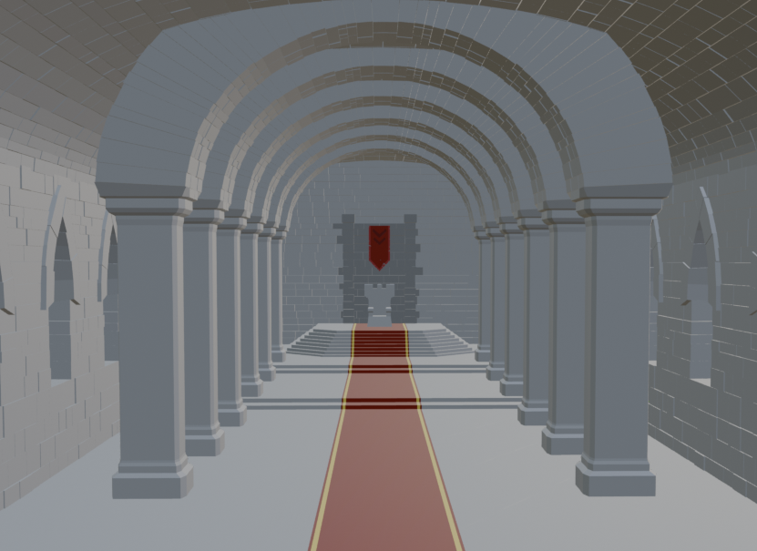
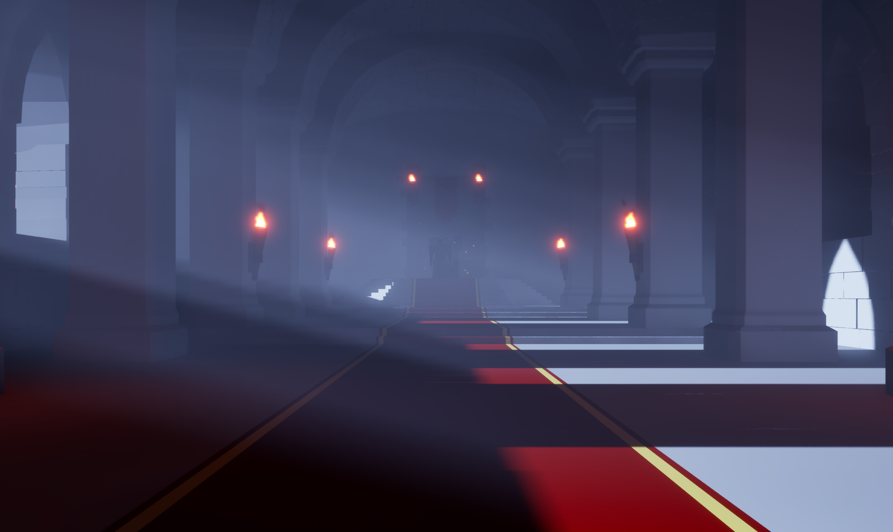
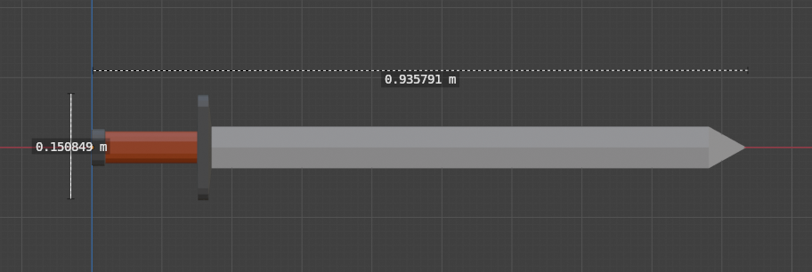
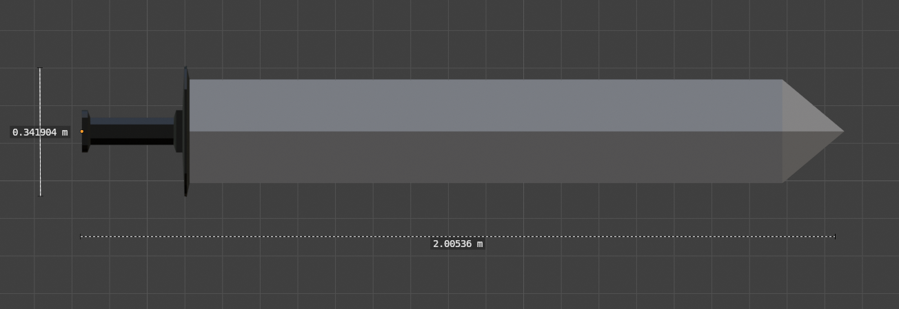
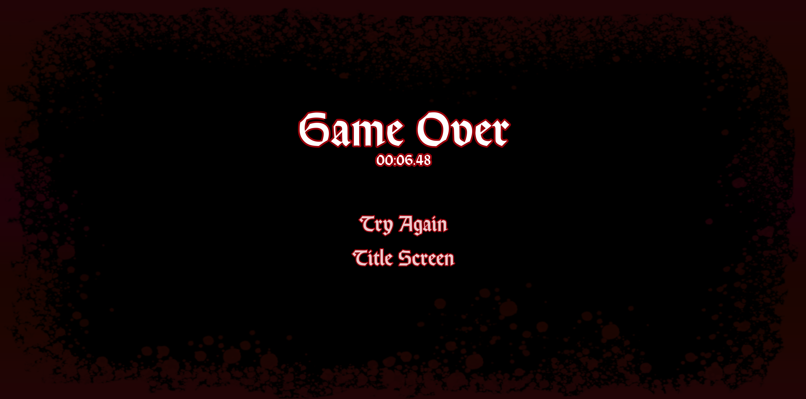
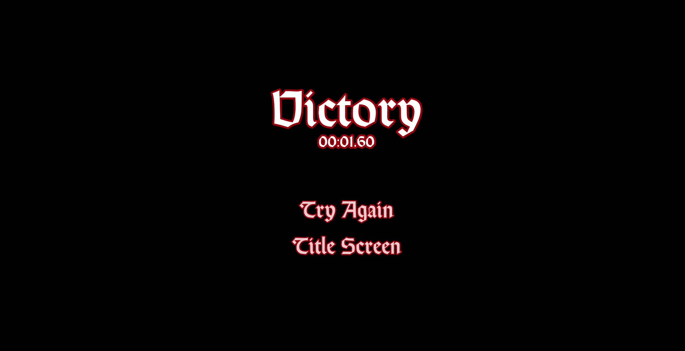

# Teilaufgabe Peißl Nevio
\textauthor{Peißl}

## Literaturrecherche

In diesem Kapitel werden die theoretischen Grundlagen für die Erstellung von 3D-Modellen, Benutzeroberflächen und Cutscenes, die für das Spiel "ConquerTheCastle" benötigt werden, behandelt.

### Blender

Blender ist ein Open-Source-3D-Programm, das von der Blender Foundation entwickelt wird und kostenlos zugänglich ist. Es deckt alle wesentlichen Schritte der 3D-Modellierung ab. Dazu zählen Modeling, Animation, Simulation, Rendering und Export. Dadurch ist es möglich, den gesamten 3D-Workflow innerhalb von Blender durchzuführen, ohne zusätzliche externe Software zu verwenden. [@blender_features]

Die Mission von Blender ist es, ein leistungsstarkes 3D-Programm für jeden frei zugänglich zu machen. Blender wird von einer großen Community entwickelt, wobei jeder einen Beitrag leisten kann. [@blender_about]

Blender ist für diese Arbeit eine optimale Lösung, da es frei verfügbar, leistungsstark und durch eine große, aktive Community unterstützt wird. Zudem gibt es zahlreiche frei zugängliche Online-Tutorials und umfangreiche Dokumentationen. Die Software erhält regelmäßig Updates und wird kontinuierlich erweitert. Blender ist auf den gängigen Betriebssystemen (Linux, Windows und macOS) verfügbar und basiert auf OpenGL. [@blender_manual]

#### Koordinatensystem {#theorie-koordinatensystem}

Beim Erstellen eines neuen Blender-Projekts ist zunächst nur das Koordinatensystem sichtbar. Dieses besteht aus drei Achsen: X, Y und Z. Die Achsen erstrecken sich jeweils vom positiven bis zum negativen Bereich und treffen sich im Nullpunkt. Sie dienen als Orientierungshilfe und bieten dem Benutzer einen festen Bezugspunkt innerhalb der Szene. Zusätzlich befindet sich rechts oben ein kleines Achsendiagramm, das die Orientierung des Nutzers in Echtzeit anzeigt (siehe Abb. 1). [@blender_manual]

![Koordinatensystem [@blender]](img/peissl/theorie/koordinatensystem.png){width=90%}

Die Kamera kann mit dem Mausrad rotiert und mit Shift + Mausrad verschoben werden. [@blender_manual]

Der 3D-Cursor, der in Abb. 1 sichtbar ist, definiert die Position, an der neue Objekte hinzugefügt werden. Standardmäßig befindet er sich im Nullpunkt und kann mit Shift + rechter Maustaste frei im 3D-Raum verschoben werden. Wird der Cursor versetzt, ändert sich entsprechend die Einfügeposition neuer Objekte. Mit Shift + C kann der Cursor wieder auf den Nullpunkt zurückgesetzt werden. [@blender_manual]

#### Primitive Objekte {#theorie-primitive-objekte}

Blender bietet mehrere primitive Basisobjekte, die mithilfe der Tastenkombination Shift + A eingefügt werden können. Dazu zählen unter anderem der Würfel, der Zylinder oder die Kugel (siehe Abb. 2). Diese Objekte besitzen typische Anwendungsfälle: Für Gebäude wird häufig ein Würfel verwendet, während sich ein Zylinder besonders für Säulen eignet. [@blender_manual]

Wird ein Objekt ausgewählt, ist es orange umrandet. Der Ursprung des Objekts wird sichtbar, und das Objekt wird im Outliner auf der rechten Seite markiert (siehe Abb. 2, Zylinder). [@blender_manual]

![Objekte [@blender]](img/peissl/theorie/objekte.png){width=90%}

Objekte bestehen aus Vertices, Edges und Faces. Ein Vertex stellt einen einzelnen Punkt dar. Werden zwei Vertices verbunden, entsteht eine Edge. Mehrere verbundene Edges ergeben eine Face. Verbinden sich mehrere Faces, entsteht ein Mesh, welches das eigentliche Objekt darstellt. [@blender_manual]

Diese Objekte werden verändert, um das gewünschte Ergebnis zu erzielen. Objekte können verschoben (`G`), rotiert (`R`) und skaliert (`S`) werden. Wenn ein Objekt verschoben wird und dazu eine Achse (X, Y oder Z) ausgewählt wird, verschiebt sich das Objekt nur auf dieser Achse. Wenn ein Objekt genau einen Meter nach X positiv verschoben werden sollte, lautet der Befehl `G + X + 1`. [@blender_manual]

#### Bearbeitungsmodi {#theorie-bearbeitungsmodi}

##### Object Mode {#theorie-object-mode}

Der Object Mode ist der Standardmodus in Blender. In diesem Modus können Objekte eingefügt, gruppiert, verschoben, skaliert und rotiert werden. Er dient der Anordnung von Objekten innerhalb der Szene. Die Geometrie der Objekte kann in diesem Modus nicht verändert werden. Der Object Mode ist essenziell, um den Überblick über die gesamte Szene zu behalten. [@blender_manual]

##### Edit Mode {#theorie-edit-mode}

Im Edit Mode bearbeitet man die Geometrie einzelner Objekte. Um in den Edit Mode zu kommen muss man das Objekt auswählen und `Tab` drücken. Ein weiteres `Tab` und man gelangt wieder im Object Mode. Wichtige Edit Mode Tools sind Extrude `E`, Insert `I`, Loop Cut `Ctrl + R`, Bevel `B` und Merge Vertices `M`. Mit den Tasten `1`, `2` und `3` kann zwischen der Auswahl von Vertices, Edges und Faces gewechselt werden. [@blender_manual]

#### Mirror {#theorie-mirror}
Der Mirror Modifier spiegelt ein Objekt entlang einer oder mehrerer Achsen, wobei die Spiegelung über den Objektursprung erfolgt. Dieser Modifier reduziert den Arbeitsaufwand bei symmetrischen Modellen erheblich und stellt sicher, dass beide Seiten exakt identisch sind. [@blender_manual]

#### Solidify {#theorie-solidify}
Der Solidify Modifier verleiht Objekten eine Dicke. Die einfachste Anwendung ähnelt dem Extrude-Werkzeug im Edit Mode. Die Dicke kann im Modifier-Tab über den Parameter Thickness eingestellt werden. Zusätzliche Optionen ermöglichen eine weitere Anpassung des Ergebnisses. Die Einstellung Even Thickness sorgt für eine gleichmäßige Dicke an allen Kanten, während Fill Rim offene Kanten schließt und Hohlräume verhindert. [@blender_manual]

#### Extra Mesh Objects {#theorie-extra-mesh-objects}

Extra Mesh Objects ist ein Add-on für Blender, das die dynamische Erstellung komplexer Strukturen wie Wände ermöglicht. Um es zu nutzen, muss das Add-on installiert sein. Neue Wall Objekte werden mit `Shift + A` und dem Wall Builder erstellt (siehe Abb. 3). [@blender_extra_mesh_objects]

![Wall Builder [@blender]](img/peissl/theorie/wallbuilder.png){width=90%}

Es können nun die Eigenschaften dieser Wand bearbeitet werden. Darunter zählen Anfang und Ende der Wand, die Höhe und Breite sowie die Größe der einzelnen Ziegelsteine. Es gibt noch weitere Einstellungen für Fenster, Zinnen und Treppen. [@blender_extra_mesh_objects]

#### UV-Mapping {#theorie-uv-mapping}

UV-Mapping wird zum Texturieren von Objekten benötigt. Es ist der Prozess, bei dem eine 3D-Grafik auf eine 2D-Fläche projiziert wird. Das Objekt wird aufgeschnitten und auf eine 2D Textur gelegt. Jede Fläche (Face) bekommt Koordinaten auf einer 2D-Textur. Wenn diese Textur bearbeitet wird, verändert sich auch das Aussehen des Objektes. Ohne UV-Mapping wären Texturen verzerrt, und Details gehen verloren. [@uv_mapping_guide] [@gpt_uv_mapping]

![UV Mapping [@uv_mapping_guide]](img/peissl/theorie/uv-mapping.png){width=90%}

#### Low-Poly-Modellierung {#theorie-low-poly-modellierung}

Durch die geringe Anzahl von Polygonen bleibt der Rechenaufwand eher gering und die Framerate ist stabiler. Außerdem verkürzen sich Ladezeiten, besonders auf älteren Geräten. Low-Poly hält den Style einheitlich und reduziert den Modellierungsaufwand drastisch. Ein Low-Poly Spiel setzt nicht auf hochauflösende Grafik oder komplexe Modelle, sondern auf die Einfachheit und Effizienz. [@low_poly] [@why_low_poly]

![Low-Poly Beispiel [@low_poly_example]](img/peissl/theorie/low-poly-example.png){width=90%}

#### Exportformat {#theorie-exportformat}

Blender unterstützt das Exportformat FBX, welches zum Datenaustausch zwischen verschiedenen Programmen benötigt wird. FBX ist weit verbreitet und wird von Unreal Engine sowie von vielen anderen unterstützt. Dieses Exportformat ist auf schnellen Export und Speichereffizienz optimiert und hat viele nützliche Exportfunktionen. [@blender_manual]

### Unreal Engine

Die Unreal Engine (im Folgenden UE genannt) ist eine leistungsstarke, kostenlose 3D-Entwicklungssoftware, die vielseitig eingesetzt werden kann. Egal ob Spiele programmieren, Filme produzieren oder animieren. UE verfügt über die gleichen Technologien wie AAA-Gamestudios und ist für jeden nutzbar. Mit Unreal Engine ist (fast) jeder Entwicklungsschritt in einem einheitlichen Ökosystem integriert, was den Entwicklungsprozess deutlich vereinfacht und es ermöglicht, selbst als kleines Entwicklerteam hochwertige Spiele zu entwickeln. [@what_is_unreal_engine] [@unreal_engine_indie]

#### GUI {#theorie-gui}

Das Graphical User Interface (GUI), auch Benutzeroberfläche genannt, ist eines der wichtigsten Bestandteile eines Spiels. Unter GUI versteht man alles, was vor dem eigentlichen Spiel angezeigt wird. Darunter zählt man alle Menüs sowie Lebens- und andere Statistikanzeigen. Es wird benötigt, um dem User die nötigen Informationen zu geben. Das GUI dient als Schnittstelle zwischen User und Spiel. Eine Benutzeroberfläche soll einfach, effizient und intuitiv sein. Es ist wichtig, dass jedes Element einen Namen hat, der die Funktion des Elementes intuitiv beschreibt. Mithilfe von Farben kann man den Benutzer auf bestimmte Elemente aufmerksam machen und dessen Erfahrung verbessern. Außerdem sollte jede Funktion innerhalb weniger Klicks zu erreichen sein. Funktionen, welche häufiger verwendet werden sollen leicht erreichbar sein. Das GUI muss eine Balance zwischen Funktionen und Design sein. [@ui_guide] [@what_is_a_good_ui]

Die GUI wird in Unreal Engine mithilfe von UMG (Unreal Motion Graphics) erstellt. Dazu erstellt man Widgets und bindet diese in das Spiel ein. Diese Widgets werden mit dem HUD (Heads Up Display) angezeigt und der Blueprint im Hintergrund steuert das Verhalten des Widgets. Dazu gibt es einen eigenen UMG-Editor in UE, der alle notwendigen Funktionen an einem Platz bündelt. [@ui_tutorial]

#### Cutscenes {#theorie-cutscenes}

Eine Cutscene, auch genannt Zwischensequenz, ist eine kurze Filmsequenz in einem Videospiel, welche die Geschichte weiter erzählt. Der Spieler kann während dieser Cutscene nicht eingreifen, er ist der Zuschauer. [@cutscene_explanation]

In UE wird die Cutscene mithilfe des Level Sequenzers erstellt. Zu diesem Sequenzer wird eine Kamera hinzugefügt und in der Timeline wird mithilfe von Keyframes die Kameraposition zu bestimmten Zeitpunkten angegeben. Mithilfe eines Blueprints wird festgelegt, wann die Cutscene aufgerufen wird.  [@cutscene_tutorial]

\newpage

## Praktische Arbeit

In diesem Kapitel wird die praktische Umsetzung des Bossraums, der Items, der GUI und der Cutscenes beschrieben.

### Projektspezifische Ableitungen

Die in der Theorie erarbeiteten Grundlagen wurden in der praktischen Umsetzung direkt auf drei Kernbereiche übertragen:

- **Bossraum:** Der Raum wurde als modularer Low-Poly-Raum aufgebaut. Die in [Primitive Objekte](#theorie-primitive-objekte), [Mirror](#theorie-mirror), [Solidify](#theorie-solidify) und [Low-Poly-Modellierung](#theorie-low-poly-modellierung) beschriebenen Verfahren ermöglichten eine schnelle, konsistente und performante Umsetzung.
- **GUI:** Die Benutzeroberfläche wurde bewusst reduziert und informationszentriert gestaltet, entsprechend den in [GUI](#theorie-gui) beschriebenen Prinzipien zu Lesbarkeit, Funktionstrennung und UMG-basierter Implementierung.
- **Intro-Sequenz:** Die Sequenz wurde mit dem Level Sequencer umgesetzt, wie in [Cutscenes](#theorie-cutscenes) beschrieben, um eine kontrollierte und reproduzierbare Übergangslogik zwischen Filmsequenz, Menü und Gameplay zu gewährleisten.

### Bossraum

Der Bossraum ist das Herz des Spiels. Dieser Raum erinnert an einen Thronsaal und bietet ausreichend Platz für den Kampf. Wenn der Spieler den Bossraum betritt, soll er das Gefühl haben, vor einem entscheidenden Kampf zu stehen.

#### Konzept

Das Konzept des Bossraums orientiert sich an mittelalterlichen Thronsälen. Der Raum ist länglich aufgebaut und führt den Spieler vom Eingangsbereich direkt bis zum Thron des Bosses. Elemente wie Säulen, hohe Decken, Fenster und Banner wurden verwendet, um die Macht des Bosses widerzuspiegeln.
Der Spieler kann sich während des Kampfes leicht orientieren, da der Bossraum übersichtlich aufgebaut ist und der Blick des Spielers in Richtung des Bosses geleitet wird.

Nachfolgend ist die Skizze des Bossraums dargestellt. In der Skizze sind die Eingangstür (links), der rote Teppich (orange), die Säulen (grün) und der Thron (rot) eingezeichnet. Außerdem ist die Position der Fenster violett gekennzeichnet. Der Bossraum hat eine Länge von 70 Metern, eine Breite von 30 Metern und eine Höhe von 20 Metern.

{width=90%}

#### Modellierung

Die Modellierung des Bossraumes wurde vollständig im 3D-Modellierungsprogramm Blender durchgeführt. Das Modellierungsverfahren erfolgte in mehreren iterativen Schritten: Zunächst wurden die Grundstrukturen des Bodens und der Wandflächen grob modelliert, um die räumliche Grundform zu etablieren. Die Wandkonstruktion wurde unter Verwendung des Blender-Add-ons `Wall Builder` erstellt, um eine effiziente und realistische Modellierung zu ermöglichen (vgl. [Primitive Objekte](#theorie-primitive-objekte), [Bearbeitungsmodi](#theorie-bearbeitungsmodi), [Extra Mesh Objects](#theorie-extra-mesh-objects)).

Anschließend wurden die tragenden Säulen sowie der Thronsessel als zentrale Designelemente integriert. Der Thronsessel wurde bewusst auf einer erhöhten Plattform positioniert, die durch eine Treppe erreichbar ist. Diese Designentscheidung verfolgt das Ziel, der Boss-Figur eine visuelle Hierarchie und eine übergeordnete Positionierung gegenüber dem Spieler zu verleihen. Die Fensterpositionierung wurde strategisch so gewählt, dass stets mindestens eine Säule zwischen benachbarten Fenstern positioniert ist, um Sichtblockaden zu erzeugen.

{width=90%}

Für die Eingangstür wurde eine Öffnung aus der Wandfläche geschnitten, um eine authentische Türöffnung zu schaffen und dem Spieler eine intuitive räumliche Wahrnehmung zu ermöglichen. Für die Raumdecke wurde ein Gewölbesystem gewählt, da es die Blickrichtung des Spielers gezielt auf die zentrale Boss-Position lenkt. Das Gewölbesystem wird durch mehrere kleinere, stützende Gewölbe strukturiert, die die Deckenarchitektur mit den tragenden Säulen und dem Boden verbinden und damit eine statisch wirkungsvolle Raumkomposition erzeugen. Symmetrische Bauteile wurden mit dem [Mirror-Modifier](#theorie-mirror) erstellt; Flächen mit erforderlicher Materialstärke wurden über [Solidify](#theorie-solidify) umgesetzt.

#### Texturierung

Für die Wandoberflächen wurde ein neutrales Grau gewählt, das Steinoberflächen realistisch darstellt. Durch die Verwendung von verschiedenen Grautönen und Schattierungen wurde eine räumliche Tiefenwirkung erzeugt und bestimmte Bereiche visuell hervorgehoben, um gewisse Teile der Raumarchitektur besser darzustellen. Die Zuordnung der Texturen basiert auf dem zuvor beschriebenen [UV-Mapping](#theorie-uv-mapping).

Der Fußbodenteppich wurde bewusst in intensivem Rot texturiert, da diese Farbwahl eine mehrfache Funktion erfüllt: Zum einen lenkt sie die Blickrichtung des Spielers unmittelbar zur Boss-Position hin. Zum anderen vermittelt die rote Färbung durch ihre typische Assoziation mit Gefahr, Macht und Autorität ein Gefühl von Respekt gegenüber dem Boss-Charakter.

#### Optimierung

Um die Polygonenanzahl des Bossraummodelles möglichst gering zu halten, wurden sämtliche Optimierungsstrategien angewendet. Die Grundstrukturen des Raumes (Boden, Wände, Decke) wurden mit minimaler Geometrie konstruiert. Statt komplexer, organischer Formen wurden hauptsächlich einfache geometrische Flächen und Formen verwendet. Dies reduzierte die Verarbeitungslast erheblich, ohne die visuelle Qualität wesentlich zu beeinträchtigen und folgt den Prinzipien der [Low-Poly-Modellierung](#theorie-low-poly-modellierung).

Sich wiederholende Elemente wie Säulen und Wandsegmente wurden als wiederverwendbare Modelle erstellt und mehrfach platziert, statt individuelle Geometrie für jedes Element zu modellieren. Dies reduzierte die Modellierungszeit drastisch.

Das resultierende Modell hat etwa 80.000 Polygone, was eine optimale Balance zwischen visueller Qualität und Performance-Anforderungen darstellt.

#### Export & Integration in Unreal Engine

Zunächst wurde sichergestellt, dass alle Komponenten des Bossraums korrekt in Blender organisiert waren. Das Modell bestand aus mehreren separaten Objekten (Wände, Säulen, Thronsessel, Tür, Treppen, dekorative Elemente), die zunächst alle aus einzelnen Objekten bestanden. Diese verteilte Struktur ermöglichte Flexibilität bei der Modellierung, musste aber für den Export konsolidiert werden (vgl. [Exportformat](#theorie-exportformat)).

Vor dem Export wurden alle angewendeten Modifier (insbesondere Mirror und Solidify) "angewendet", um sicherzustellen, dass diese Transformationen in der FBX-Datei persistent gespeichert werden. Dies geschah durch Auswahl des Modifiers und Klick auf "Apply" im Modifier-Panel.

Der Export wurde mithilfe des Menüpfads `File > Export > FBX (.fbx)` durchgeführt. Dabei öffnete sich der Export-Dialog mit einer umfangreichen Liste von Konfigurationsoptionen. Die folgenden Einstellungen wurden konfiguriert:

- **Scale**: 1.0 (um die Maßstäbe korrekt zu erhalten)
- **Forward Axis**: -Y Forward (Standard für Unreal Engine)
- **Up Axis**: Z Up (Standard für Unreal Engine)
- **Apply Scaling**: FBX All (um Skalierungsinformationen zu bewahren)
- **Smoothing**: Aktiviert (um glatte Übergänge zwischen Flächen zu gewährleisten)
- **Apply Modifiers**: Aktiviert (um alle Modifier in der Geometrie zu berücksichtigen)
- **Bake Animation**: Deaktiviert (da das Modell nicht animiert ist)

Nach diesen Schritten erhält man eine `.fbx`-Datei im ausgewählten Pfad.

Nach dem erfolgreichen Export wurde die FBX-Datei in das Unreal Engine 5 Projektverzeichnis (`Content/Bossraum/`) kopiert. Unreal Engine erkannte die Datei automatisch und importierte sie. Bei der Bestätigung des Imports wurden folgende Parameter konfiguriert:

- **Skeletal Mesh**: Deaktiviert (nicht erforderlich für statische Modelle)
- **Create Physics Asset**: Deaktiviert
- **Create Default Material**: Aktiviert (um automatisch Material-Platzhalter zu erstellen)
- **LOD Settings**: Automatisch (um Level-of-Detail zu generieren)
- **Material Import Method**: Create New Materials
- **Import Textures**: Aktiviert (falls Textur-Dateien vorhanden waren)

Die Kollisionsdaten wurden basierend auf der importierten Geometrie automatisch generiert. Danach wurde die Collision im Details-Panel auf `Use Complex Collision As Simple` gesetzt.

Nach dem Import wurde das Modell im Level platziert und mithilfe verschiedener Ansichten (Lit, Unlit, Wireframe, Normalansicht) überprüft, ob alles richtig gerendert wird.

{width=90%}

\newpage

### Items

Die Gestaltung dieser Waffen folgt dem mittelalterlichen Gesamtstil des Spiels und unterstützt die direkte Verständlichkeit der Spielmechanik.

#### Zielsetzung der Item-Gestaltung

Bei der Ausarbeitung der Waffen standen drei Ziele im Vordergrund:

1. **Gameplay-Klarheit:** Waffen sollten auf den ersten Blick als kampfrelevante Objekte erkennbar sein.
2. **Konsistenz:** Form und Textur sollten zum Low-Poly-Mittelalterstil des Spiels passen.
3. **Proportionen:** Die Größe der Waffen musste mit der Körpergröße der jeweiligen Figur harmonieren.

#### Modellierungs-Workflow

Die Modellierung erfolgte in Blender auf Basis einfacher Grundkörper (Cube, Plane, Cylinder), die schrittweise in Form gebracht wurden. Dabei wurde auf eine saubere Trennung von Klinge und Griff geachtet, um Materialzuweisungen in Unreal Engine zu vereinfachen. Für symmetrische Bauteile wurde der Mirror-Modifier verwendet, wodurch die Modellierungszeit reduziert und eine exakte Achsensymmetrie sichergestellt wurde (vgl. [Primitive Objekte](#theorie-primitive-objekte), [Edit Mode](#theorie-edit-mode), [Mirror](#theorie-mirror)).

#### Player Schwert

Das Schwert des Spielers wurde als Einhandschwert mit einer Gesamtlänge von etwa 1,0 m ausgelegt. Diese Dimension orientiert sich an der Körpergröße des Spielercharakters (ca. 1,80 m) und unterstützt ein ausgewogenes Verhältnis zwischen Reichweite, Lesbarkeit und Beweglichkeit.

Die Klinge wurde relativ schlank modelliert, um Schnelligkeit und Präzision zu vermitteln. Für die Klinge wurden helle Metalltöne gewählt, damit ein Kontrast zwischen Klinge und Bossraum entsteht. Der Griff verwendet dunklere, lederartige Farbtöne, um eine klare Materialtrennung herzustellen.

Das Player-Schwert signalisiert einen kontrollierten, direkten Kampfstil. Es wirkt weder überdimensioniert noch ornamental, wodurch der Fokus auf Gameplay und Reaktionsgeschwindigkeit erhalten bleibt.

{width=90%}

#### Boss Schwert

Das Boss-Schwert wurde als großformatige Zweihandwaffe mit einer Länge von etwa 2,0 m umgesetzt. Die Dimension ist auf die Körpergröße des Bosses (ca. 3,20 m inklusive Hörner) abgestimmt und unterstreicht dessen dominante Rolle innerhalb des Kampfes.

{width=90%}

#### Export & Integration in Unreal Engine

Nach Abschluss der Modellierung wurden beide Schwerter im FBX-Format aus Blender exportiert und in Unreal Engine als statische Meshes importiert. Während des Imports wurde darauf geachtet, dass Maßstab und Achsenausrichtung den Projektstandards entsprechen (vgl. [Exportformat](#theorie-exportformat)).

\newpage

### GUI

Die GUI (Graphical User Interface) bildet die visuelle Schnittstelle zwischen Spieler und Spiel. Sie umfasst alle Bildschirmelemente, die außerhalb der eigentlichen Spielwelt dargestellt werden. Während die GUI alle visuellen Elemente der Benutzeroberfläche bezeichnet, beschreibt das HUD speziell jene Informationsfläche, die während des Spielgeschehens relevante Daten wie Spieler-Lebenspunkte, Ausdauer und Boss-Lebenspunkte anzeigt. Die praktische Umsetzung folgt den im Theorie-Abschnitt [GUI](#theorie-gui) beschriebenen Prinzipien.

#### Zielsetzung der Benutzeroberfläche

Die primäre Zielsetzung der GUI besteht darin, dem Spieler ausschließlich essentielle Informationen bereitzustellen, ohne ihn dabei durch visuelle Überfrachtung abzulenken. Jedes UI-Element wurde so gestaltet, dass seine Funktion ohne zusätzliche Erklärung verständlich ist. Dies trägt dazu bei, dass sich der Spieler auf das Kampfgeschehen konzentrieren kann, während ihm gleichzeitig alle notwendigen Informationen zur Verfügung stehen.

#### Rolle der GUI im Spielablauf

Die GUI übernimmt verschiedene Funktionen in unterschiedlichen Spielphasen. Zu Beginn leitet das Hauptmenü den Spieler durch die ersten Schritte und ermöglicht den Einstieg ins Spiel. Sobald der Kampf beginnt, übernimmt das HUD die zentrale Rolle: Es zeigt dem Spieler kontinuierlich seine aktuelle Lebenspunkteanzahl sowie seine verfügbare Ausdauer an. Zusätzlich wird die Lebensleiste des Bosses prominent dargestellt, sodass der Spieler den Kampfverlauf nachvollziehen und seine Strategien dynamisch anpassen kann. Nach einem Spieler-Tod erscheint der Death-Screen, der dem Spieler Optionen zur Fortsetzung bietet. Wenn der Boss besiegt wurde, erscheint der Victory-Screen. Das Statistikmenü ermöglicht es, wichtige Spielinformationen und die beste Zeit einzusehen.

#### Abgrenzung zwischen Spielwelt und Benutzeroberfläche

Die GUI existiert außerhalb der eigentlichen Spielwelt und wird als zweidimensionale Überlagerung im Vordergrund des Bildschirms dargestellt. Diese Trennung zwischen Spielwelt und Benutzeroberfläche wird technisch durch das UMG-Framework realisiert, welches die GUI-Elemente unabhängig von der 3D-Szene rendert. Dadurch bleibt die GUI stets sichtbar und lesbar, unabhängig von Kamerabewegungen oder Spielgeschehen. Diese klare Abgrenzung ermöglicht es dem Spieler, zwischen spielrelevanten Informationen (GUI) und der eigentlichen Spielwelt zu unterscheiden. Das `Head-up-Display` (HUD) wurde mithilfe von `pixilart.com` erstellt. In der folgenden Abbildung sieht man das HUD im Editor.

{width=90%}

#### UI-Komponenten und Layout

Die einzelnen Widgets bestehen aus verschiedenen Standard-UI-Komponenten:

- **Canvas Panel**: Dient als übergeordneter Container, der absolute und relative Positionierung ermöglicht.
- **Buttons**: Interaktive Schaltflächen mit Hover- und Click-Events, die über Blueprints mit Spiellogik verknüpft sind.
- **Progress Bars**: Visuelle Balken zur Darstellung von Lebenspunkten und Ausdauer, deren Füllstand dynamisch aktualisiert wird.
- **Text Blocks**: Textfelder für Beschriftungen und Informationsdarstellung.
- **Images**: Grafische Elemente zur visuellen Gestaltung und Dekoration.

Für jedes GUI-Element wurde ein separates Widget erstellt. Ein Widget ist ein wiederverwendbares UI-Element, das sowohl visuelle Komponenten als auch zugehörige Logik enthält. Folgende Widgets wurden implementiert:

- **Mainmenu-Widget**: Enthält Buttons für "Play", "Statistics" und "Quit". Das Layout wurde links ausgerichtet und mit konsistenten Abständen zwischen den Buttons versehen, um dem Spieler die Sicht auf die Burg zu erhalten.

{width=90%}

- **Statistics-Menu-Widget**: Zeigt Spielstatistiken wie gespielte Spiele, Bestzeit und weitere Errungenschaften an.

{width=90%}

- **HUD-Widget**: Beinhaltet Progress-Bars für Spieler-Lebenspunkte (rot) und Ausdauer (hellblau) sowie die Boss-Lebensleiste. Zusätzlich wurde ein `low-health-indikator` umgesetzt, der bei weniger als 30 % Lebenspunkten als visuelles Warnsignal am Rand des Bildschirms eingeblendet wird.
{width=90%}

- **Death-Screen-Widget**: Wird bei Spieler-Tod eingeblendet und bietet Optionen zum Neustart oder zur Rückkehr ins Hauptmenü. Der eingeblendete `low-health-indikator` macht den zuvor kritischen Gesundheitszustand auch in dieser Phase nachvollziehbar.

{width=90%}

- **Victory-Screen-Widget**: Wird nach dem Besiegen des Bosses eingeblendet und bietet Optionen zum erneuten Spielen oder zur Rückkehr ins Hauptmenü. 

{width=90%}

\newpage

### Cutscenes erstellen

Cutscenes dienen in ConquerTheCastle der Einführung des Spielers in die Spielwelt. Die Sequenzen wurden mit dem Level Sequencer der Unreal Engine erstellt und über ein Blueprint-System in das Spielgeschehen integriert. Grundlage dafür ist der Theorie-Abschnitt [Cutscenes](#theorie-cutscenes).

#### Intro Cutscene

Die Intro-Cutscene führt den Spieler in die Spielwelt ein und zeigt die Umgebung außerhalb des Bossraums, bevor das eigentliche Gameplay beginnt. Sie gibt dem Spieler Zeit, sich auf den bevorstehenden Kampf vorzubereiten. Die Sequenz endet mit der Einblendung des Hauptmenüs, das die weitere Spielprogression steuert.

#### Erstellung mit Level Sequencer

Für die Cutscene wurde ein neuer Level Sequencer erstellt. Dies erfolgte über den Menüpfad "Cinematics > Add Level Sequence". Die Sequenz wurde im Content-Verzeichnis unter einem eigenen Cutscenes-Ordner organisiert, um eine klare Projektstruktur zu gewährleisten. Anschließend wurde ein Cine Camera Actor hinzugefügt, der als virtuelle Filmkamera fungiert.

Die Kamerabewegungen wurden durch das Setzen von Keyframes zu bestimmten Zeitpunkten festgelegt. An relevanten Positionen der Timeline wurde die Kamera im Viewport manuell positioniert und jeweils ein Keyframe gesetzt. Der Sequencer berechnet die Kameraposition zwischen diesen Keyframes automatisch und erzeugt dadurch flüssige Bewegungsabläufe. Für die Intro-Cutscene wurden mehrere Keyframes gesetzt, um eine schwenkende und fahrende Bewegung über die Intro-Welt zu erzeugen.

{width=90%}

Die Intro-Cutscene wurde auf eine Dauer von etwa 15 Sekunden festgelegt, da dieser Zeitraum ausreicht, um die Außenwelt darzustellen. Gezeigt werden die Burg als zentraler Ort des Kampfes sowie die umliegende Stadt.

#### Spielablauf

Beim Start des Spiels wird zunächst die Intro-Cutscene abgespielt. Der nachfolgende Blueprint zeigt den grundlegenden Ablauf der Sequenz und macht die Übergänge zwischen Cutscene, Hauptmenü und Spielstart nachvollziehbar.

{width=90%}

Der folgende Blueprint zeigt den Start der Cutscene über den Level Sequencer. Nach etwa 17 Sekunden wird die Sequenz pausiert, um das Main Menu anzuzeigen.

{width=90%}

Nach dem Pausieren wird das Main Menu angezeigt, und die Mauseingabe für den Spieler wird aktiviert.

{width=90%}

Wählt der Spieler "Play", wird die Cutscene fortgesetzt. Gleichzeitig wird der Input des Spielers erneut deaktiviert, um eine unterbrechungsfreie Sequenzwiedergabe sicherzustellen.

{width=90%}

{width=90%}

Nach Abschluss der Cutscene wird der Bossraum geöffnet, der Input aktiviert und ein "Fade-In" abgespielt, um einen konsistenten Übergang zwischen Cutscene und Kampf zu schaffen. Anschließend beginnt der Kampf.

{width=90%}

