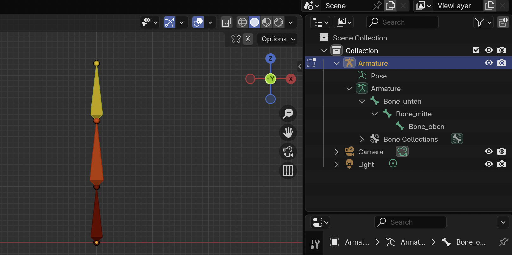
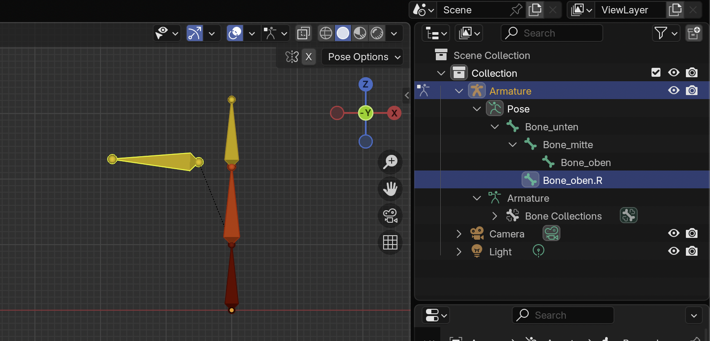
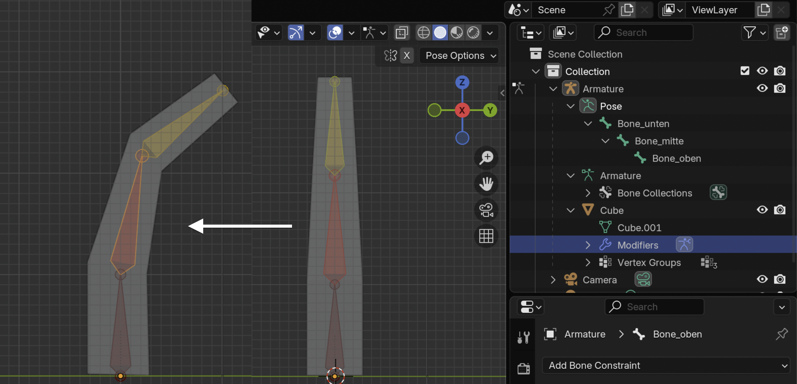
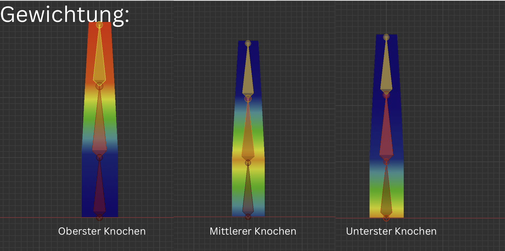

# Teilaufgabe Schüler Schmiedpeter
\textauthor{Schmiedpeter}

## Blender

### Einleitung in Blender

#### Möglichkeiten

Blender ist ein Programm mit vielen Einsatzmöglichkeiten. Es eignet sich für die Modellierung, bietet eine Zeichenfunktion sowie einen Python-Editor. Zusätzlich können bestehenden Modellen Animationen hinzugefügt werden. Darüber hinaus lassen sich in Blender auch Videos rendern und schneiden.

#### Basics der Modellierung

Blender ist wie folgt aufgebaut: In der Mitte befindet sich das Koordinatensystem, in dem der Großteil der Arbeit stattfindet. Links liegen die wichtigsten Werkzeuge. Rechts befindet sich die Objekthierarchie mit Kamera, Licht und allen Objekten. Im unteren bzw. rechten Modulbereich sind Funktionen wie Modifier, Material und Physik zu finden.

![Koordinatensystem [@blender]](img/schmiedpeter/Defaultscreen-blender.png){width=90%}

In der Modellierungsansicht gibt es drei Modi mit jeweils eigener Funktion:

- **Objektmodus:** Dieser Modus wird hauptsächlich für den Umgang mit mehreren Objekten und zum Einfügen neuer Objekte verwendet. Blender stellt standardmäßig Objekte wie Würfel, Quader, Zylinder oder Kugeln bereit. Diese sind zunächst auf Standardgröße gesetzt und können in Größe sowie Ursprung (`Set Origin`) angepasst werden. Außerdem werden in diesem Modus Funktionen wie Physik oder Modifier genutzt. Wichtige Werkzeuge sind Bewegen, Rotieren und Skalieren.
  
- **Editmodus:** Dieser Modus dient zur Bearbeitung einzelner Objekte.

  > Der Modus funktioniert auch mit mehreren Objekten. Das ist jedoch nicht empfohlen, weil dabei leicht ungewollte Fehler entstehen können.

  Die Auswahl funktioniert hier anders als im Objektmodus: Es werden keine ganzen Objekte, sondern Punkte, Kanten oder Flächen ausgewählt. Standardmäßig ist die Punktansicht aktiv. Nach demselben Prinzip funktionieren die Kanten- und Flächenansicht. *Tipp: Mit `Shift` können mehrere Elemente ausgewählt werden.*
  Wichtige Werkzeuge sind Loop Cuts und das Messer (zum Hinzufügen von Kanten), Bewegen, Einsetzen/Verkleinern von Flächen, Extrahieren sowie Füllen.

- **Skulpturmodus:** Dieser Modus nutzt Werkzeuge, die Polygone auf unterschiedliche Weise verformen. Dabei ist zu beachten, dass die Verformung nicht exakt maßbasiert erfolgt. Zusätzlich sollte das Objekt genügend Polygone besitzen, da das Ergebnis sonst oft nicht den Erwartungen entspricht.

Als Unterstützung in den jeweiligen Modi gibt es das Tool **Anmerkungen**. Damit können in der aktuellen Perspektive Markierungen eingezeichnet werden. Im Edit- und Objektmodus kann zusätzlich das Tool **Messen** verwendet werden. Dieses funktioniert ebenfalls perspektivbezogen und arbeitet wie Anmerkungen in 2D.
  
### Konkurrenz

Neben Blender hätten auch andere Modellierungsprogramme verwendet werden können, beispielsweise *Tinkercad, Autodesk Fusion oder OpenSCAD*. 

- **Tinkercad:** Das Programm ist vor allem durch das einfache Entwerfen von Schaltungen bekannt und ähnlich niedrigschwellig ist auch die Modellierung. Es ist leicht verständlich und damit gut für Einsteiger geeignet. Für die Diplomarbeit war es jedoch zu eingeschränkt, da viele Formen nur mit vorgefertigten, kaum veränderbaren Grundobjekten erstellt werden können.

- **Autodesk Fusion:** Dieses Programm ist stark auf Produktion, Werkzeuge und technische Konstruktion ausgerichtet, kann aber auch für Modellierung eingesetzt werden. Die Handhabung gilt als gut und es wird von großen Unternehmen eingesetzt. Nachteilig sind die Lizenzkosten.

- **OpenSCAD:** OpenSCAD ist ein Open-Source-Programm für codebasierte Modellierung. Für dieses Projekt war es aufgrund der höheren Komplexität nicht die passende Wahl.

### Nützliche Befehle

- **`Shift + A`**: Objekt hinzufügen.
- **`X`**: Löschen (mit Bestätigungsabfrage).
- **`TAB`**: Modus wechseln (Objektmodus/Editmodus).
- **`LEERZEICHEN`**: Zeitleiste abspielen/stoppen.

Für die folgenden Befehle gilt:

- Mit zusätzlichem Drücken von `X`/`Y`/`Z` wird auf die jeweilige Achse eingeschränkt.
- Mit `Shift` erfolgen feinere Bewegungen.

- **`G`**: Verschieben im Koordinatensystem.
- **`R`**: Drehen um den Ursprung (oranger Punkt).
- **`S`**: Skalieren um den Ursprung.

Für den Objektmodus:

- **`Str + J`**: Objekte zusammenführen. Funktioniert mit zwei oder mehr Objekten; dabei bleibt ein aktives Primärobjekt erhalten (z. B. für den Ursprung).
- **`Rechtsklick` + Ursprung ändern**: Ursprung versetzen (z. B. nach Masse oder Volumen).
- **`Rechtsklick` + Weich schattieren**: Kanten optisch glätten, ohne Polygone hinzuzufügen.

Für den Editmodus:

- **`M`**: Punkte zusammenfügen. Funktioniert mit zwei oder mehr Punkten (bzw. Kanten/Flächen werden in Punkte umgewandelt); möglich auf erstem/letztem Punkt, in der Mitte oder beim Ursprung.
- **`Str + R`**: Loop Cuts. Erstellt umlaufende Kanten; die Anzahl der Schnitte kann eingestellt werden.
- **`K`**: Messer. Fügt Schnitte in ein Objekt ein.
- **`E`**: Extrahieren. Erweitert Flächen bzw. Kanten.
- **`I`**: Einsetzen von Flächen. Erzeugt eine kleinere Fläche in einer größeren.
- **`F`**: Füllen von Flächen/Kanten. Bei zwei Punkten entsteht eine Kante, sonst eine Fläche; bei sehr vielen Punkten können ungünstige Flächen entstehen.
- **`Str + T`**: Flächen in Dreiecke konvertieren. Sinnvoll für Export und Rendering.

## Erweiterte Funktionen in Blender

### Material

Material beschreibt das Aussehen eines Objekts bzw. einzelner Flächen. Dazu gehören unter anderem Farbe, Metalleffekt, Rauheit und weitere definierbare Eigenschaften. Standardmäßig ist ein Material neutral und hellgrau, damit Effekte und Farben die Modellierung nicht stören.

![Material-Erklärung [@blender]](img/schmiedpeter/Material_blender.png){width=90%}

Objekte lassen sich im Editmodus einfärben. Einzelnen Flächen können Farben zugewiesen werden, indem zuerst die Flächen und danach das gewünschte Material ausgewählt werden. Damit die Farben sichtbar sind, muss das Shading auf Material-Vorschau oder Rendered gestellt werden.

### Modifier

Modifier sind Erweiterungen mit eigenen Funktionen. Es gibt viele davon, in einem Projekt wird jedoch meist nur ein Teil tatsächlich genutzt. Manche Modifier erleichtern bestehende Arbeitsschritte, andere bieten zusätzliche Funktionen. Zu finden sind sie rechts unter dem Schraubenschlüssel-Symbol.

Modifier sind in Kategorien gegliedert; besonders relevant sind **Erzeugen** und **Physik**. Wichtig ist, dass Blender zunächst nur eine Vorschau zeigt. Erst nach dem Anwenden wird die Änderung dauerhaft in die Geometrie übernommen. Häufig verwendete Modifier sind Boolean, Mirror und Collision.

#### Boolean

Mit dem Boolean-Modifier kann ein Objekt mit einem zweiten Objekt verrechnet werden. Je nach Modus sind **Schnittmenge, Vereinigung oder Differenz** möglich. Dafür werden ein primäres und ein sekundäres Objekt benötigt.

#### Mirror

Der Mirror-Modifier spiegelt ein Objekt entlang der gewählten Achse. Gespiegelt wird nicht um die geometrische Mitte, sondern um den Ursprung des Objekts.

#### Physik

Physik ist kein einzelner Modifier, sondern eine eigene Kategorie. Hier reagieren Objekte nach physikalischen Regeln der realen Welt. Möglich sind beispielsweise Simulationen mit Flüssigkeiten oder Stoffen. Viele Physik-Modifier benötigen ein zweites Objekt mit dem Modifier **Collision**, damit Kollisionen überhaupt erkannt werden.

Ein typisches Beispiel ist der Cloth-Modifier. Er verhält sich wie ein Stofftuch: Startet man die Simulation mit `LEERZEICHEN`, fällt das Objekt nach unten. Befindet sich ein Collision-Objekt im Weg, bleibt der Stoff daran hängen. Da Flächen aus Polygonen bestehen, hängt die Qualität stark von der Geometrie und den Einstellungen (z. B. Gewicht, Steifigkeit) ab. Nach dem Anwenden wird die simulierte Form als fester Zustand übernommen.

## Animationen
### Zweck und Nutzen von Animationen
Animationen sind notwendig, um statische Modelle in glaubwürdige, lesbare und emotionale Figuren zu verwandeln. In Spielen und Visualisierungen übernehmen sie mehrere Aufgaben: Sie machen Handlungen verständlich (z. B. Gehen, Angreifen), stärken die Identität einer Figur durch charakteristische Bewegungen und unterstützen die Spielmechanik durch klare Rückmeldungen (z. B. Treffer, Ausweichen). Ohne Animationen bleibt ein Modell reiner Blickfang, aber es kann keine Handlung vermitteln und wirkt technisch wie dramaturgisch unvollständig.

### Grundlagen des Rigging mit Armature
Die Armature ist das Skelett einer Figur. Sie besteht aus Knochen (Bones), die hierarchisch verbunden sind und die spätere Bewegung definieren. Jeder Knochen besitzt einen Kopf und ein Ende; aus der Ausrichtung ergibt sich die lokale Achse, die für Rotationen entscheidend ist. Damit eine Armature sauber funktioniert, müssen Skalen der Meshes angewendet sein und die Bone-Orientierungen konsistent angelegt werden.

**Parent-Knochen (Elternknochen)** bestimmen die Hierarchie. Bewegungen eines Elternknochens wirken auf alle darunterliegenden Kinderknochen. Dadurch lassen sich Ketten wie Wirbelsäule, Arm oder Bein logisch aufbauen. Ein Unterarm ist z. B. Kind des Oberarms, sodass eine Rotation des Oberarms die gesamte Kette mitführt.

{width=80%}

**Keep Offset** entstehen, wenn ein Knochen einem Elternknochen zugewiesen wird, seine aktuelle Position jedoch beibehält. Das bedeutet: Die Hierarchie wirkt, aber der Kindknochen verschiebt sich beim Parenten nicht an den Kopf des Elternknochens. Diese Variante ist sinnvoll, wenn der Abstand zwischen Knochen bewusst erhalten bleiben soll, z. B. bei Zubehör, Sekundärbewegungen oder technischen Rigs. Erstellt wird dies im Pose- oder Edit-Mode durch Auswahl von Kind und Elternknochen und anschließend `Str + P` mit der Option Keep Offset. So bleibt der Abstand erhalten, die Vererbung der Bewegung ist aber aktiv.

{width=80%}

**Inverse Kinematik (IK)** wird eingesetzt, wenn man das Ende einer Knochenkette direkt steuern möchte, z. B. Hände, Füße oder ein Knie beim Aufsetzen auf den Boden. Im Gegensatz zur Vorwärtskinematik (FK), bei der jeder Knochen einzeln rotiert wird, berechnet IK die Winkel der gesamten Kette automatisch, damit das Endglied ein Ziel erreicht. Technisch wird dazu ein Ziel-Objekt (IK-Target) definiert und ein IK-Constraint auf den Endknochen gesetzt; eine Kettenlänge bestimmt, wie viele Knochen beeinflusst werden. So lassen sich stabile Kontaktpunkte erzeugen, etwa wenn eine Hand eine Waffe hält oder ein Fuß sauber am Boden bleibt.

### Anwendung an Figuren: Vorgehensweise
Für die Anwendung an einer Figur wird ein Mesh benötigt, eine Armature und eine klare Bindung zwischen beiden. Ziel ist es, dass die Knochenbewegung das Mesh nachvollziehbar verformt, ohne sichtbare Artefakte zu erzeugen. Eine Abbildung kann hier optional den Aufbau von Mesh, Armature und Gewichtung verdeutlichen.

Benötigte Schritte:
1. Mesh vorbereiten (Skalierung anwenden, Ursprung setzen).
2. Armature platzieren und Knochen entlang der geplanten Bewegung anordnen.
3. Parenting zwischen Mesh und Armature herstellen.
4. Gewichte (Weights) prüfen und bei Bedarf korrigieren.

Gerade bei organischen oder flexiblen Objekten ist die Verteilung der Gewichte entscheidend, da zu harte Übergänge die Bewegung unnatürlich wirken lassen.

{width=80%}

### Gewichtung und Bindung des Meshes
Das Verbinden von Mesh und Armature erfolgt in Blender über das Parenting. Dabei gibt es mehrere Modi, die das Grundgerüst der Gewichtung erzeugen und den Startpunkt für die spätere Feinabstimmung liefern:

**Automatic Weights**: Blender berechnet die Gewichte automatisch anhand der Nähe zu den Knochen. Dieser Modus ist effizient und liefert oft brauchbare Ergebnisse, ist jedoch bei komplexen Formen fehleranfällig. Typische Probleme sind ungewollte Verzerrungen, wenn Knochen zu nah an anderen Bereichen liegen. Deshalb ist eine anschließende manuelle Korrektur in den Weight-Painting-Modi fast immer notwendig. In der Praxis gilt: Automatic Weights sind der Startpunkt, nicht der Abschluss.

**With Empty Groups**: Erzeugt nur die notwendigen Vertex-Gruppen ohne Gewichte. Dieser Modus ist sinnvoll, wenn die Gewichtung bewusst manuell angelegt werden soll, etwa bei technischen oder sehr klar strukturierten Modellen.

**With Envelope Weights**: Nutzt die Bone-Envelopes (Einflussbereiche) anstelle von Distanzberechnung. Der Vorteil liegt in der direkten Kontrolle über Einflussradien, allerdings ist die Methode weniger präzise bei feineren Strukturen und erfordert eine saubere Envelope-Konfiguration.

**Bone-Parenting (Bone)**: Das Mesh wird einem einzelnen Knochen untergeordnet. Diese Methode eignet sich für starre Objekte (z. B. Waffen, Schilder) und lässt keine organische Deformation zu.

{width=80%}

Nach dem Parenting werden die Gewichte mit den Gewichtungstools (Weight Paint) verfeinert. Sie steuern, wie stark ein Knochen einzelne Punkte des Meshes beeinflusst. Jeder Vertex erhält 
Gewichte in sogenannten Vertex-Gruppen, typischerweise mit Werten zwischen 0 und 1. Ein Wert von 1 bedeutet volle Beeinflussung durch den Knochen, ein Wert von 0 keine. In der Praxis werden die Gewichte über Pinselwerkzeuge gemalt, geglättet oder normalisiert, damit Übergänge weich bleiben und sich die Summe der Einflüsse pro Punkt sinnvoll verteilt. So entstehen organische Deformationen, ohne dass das Mesh unerwünscht einbricht oder sich verzieht.

Wichtige Werkzeuge sind Add (Gewichte erhöhen), Subtract (Gewichte reduzieren), Blur oder Smooth (Übergänge glätten) sowie Normalize/Normalize All (Gewichte pro Vertex ausgleichen). Damit lassen sich harte Kanten vermeiden und Gelenkbereiche wie Ellbogen oder Knie sauber verformen.

### Animation erstellen in Blender
Nach dem Rigging beginnt die eigentliche Animation im **Pose Mode** der Armature. Dabei werden nicht die Mesh-Punkte direkt bewegt, sondern die Knochen. Blender speichert diese Bewegungen als Keyframes und interpoliert die Zwischenbilder automatisch.

Typische Vorgehensweise:
1. Armature auswählen und in den Pose Mode wechseln.
2. Zeitleiste auf den Startframe setzen (z. B. Frame 1).
3. Gewünschte Knochen in eine Startpose bringen.
4. Mit `I` Keyframes setzen (meist **Location**, **Rotation** oder **LocRot**).
5. Zur nächsten Zeitposition wechseln (z. B. Frame 12/24), neue Pose erstellen und erneut Keyframes setzen.
6. Dies für alle wichtigen Posen wiederholen (z. B. Kontaktpose, Passing Pose, Endpose).

Für saubere Ergebnisse werden die Kurven im **Graph Editor** oder die Keyframe-Reihenfolge im **Dope Sheet** nachbearbeitet. So lassen sich Bewegungen weicher, schneller oder härter gestalten.

Bei mehreren Animationen (z. B. Idle, Walk, Attack) sollte jede Bewegung als eigene **Action** im Action Editor gespeichert und klar benannt werden. Dadurch bleiben die Clips getrennt und können später in Unreal gezielt importiert werden.

Für Loops (z. B. Gehen) muss der letzte Frame zur Startpose passen, damit der Übergang ohne sichtbaren Sprung wieder von vorne beginnt.

### Einfügen in Unreal
Für den Export ist ein konsistentes Rig wichtig: gleiche Ausrichtung, klare Root-Struktur und einheitliche Benennung. In Unreal werden Armature und Animationen als FBX importiert. Entscheidend ist, dass die Animationen im selben Skeleton bleiben, damit sie austauschbar und wiederverwendbar sind. So kann z. B. eine Geh-Animation an mehreren Figuren genutzt werden, solange das Skelett kompatibel bleibt.

Kurzablauf für den Import:
1. In Blender als `FBX` exportieren (Mesh + Armature + gewünschte Animationen).
2. In Unreal im Content Browser `Import` wählen und die FBX-Datei laden.
3. Beim ersten Import ein neues Skeleton erzeugen, bei weiteren Animationen **dasselbe** Skeleton auswählen.
4. `Import Animations` aktivieren, damit die Actions als Animation Sequences übernommen werden.
5. Importierte Clips im Animation Preview testen (Loop, Geschwindigkeit, Root-Bewegung).

Wenn ein Clip nicht korrekt aussieht, liegt es meist an Bone-Namen, Skalierung oder an nicht angewendeten Transformationen in Blender.

## Game Sound

Game Sound ist weit mehr als akustische Dekoration. Im Computerspiel übernimmt er eine doppelte Funktion: Einerseits erhöht er die Immersion, indem er die künstliche Spielwelt mit glaubwürdigen Klangräumen füllt, andererseits liefert er dem Spieler unmittelbares Feedback auf Handlungen, Ereignisse und Zustandswechsel. Fehlen Hintergrundgeräusche, wirkt eine Szene schnell künstlich und leer; sind sie stimmig gestaltet, werden sie oft kaum bewusst wahrgenommen, stabilisieren aber das Erleben der Spielwelt nachhaltig.

Im Unterschied zu linearen Medien entsteht Sound im Spielkontext unter interaktiven Bedingungen. Atmo, Musik, Sprache und Geräusche werden nicht in einer fixen Reihenfolge abgespielt, sondern können sich abhängig von Spieleraktionen zeitlich unvorhersehbar überlagern. Genau daraus ergeben sich zentrale gestalterische Herausforderungen: Sprachverständlichkeit muss erhalten bleiben, klangliche Konflikte zwischen Ebenen sollen vermieden werden, und trotzdem muss ein konsistenter Gesamteindruck entstehen. Eine strukturierte Klanghierarchie und ein bewusstes Lautstärke- und Mischungsverhältnis sind daher Grundvoraussetzungen für professionellen Gamesound.

### Musikpsychologische Grundlagen
#### Wahrnehmung von Tönen
Die Wahrnehmung von Tönen wird in der musikpsychologischen Lehre von Ernst Kurth als Erleben von „Strebewirkungen“ beschrieben: Töne und Intervalle wirken nicht statisch, sondern erzeugen den Eindruck von gerichteter Bewegung, Spannung und möglicher Auflösung. Die Strebetendenz-Theorie (Willimek) erweitert diesen Ansatz, indem sie diese Wirkung als psychologische Identifikation des Hörers mit Willensregungen deutet. Vereinfacht bedeutet das: Der Hörer erlebt nicht nur eine Klangbewegung, sondern einen inneren Impuls gegen oder für eine Veränderung.

> „Wir erleben einen Ton nicht als Frequenz, sondern als undefinierbares Ding, das wir jedoch nicht als sinnvoll in unsere materielle Welt eingegliedert erfahren können.“ (Musik und Emotionen, S. 3)

Diese Sichtweise verdeutlicht, dass Töne nicht nur als messbare physikalische Signale verarbeitet werden, sondern als psychisch bedeutungsvolle Klangereignisse.

Für Leitton- und Vorhaltswirkungen wird dieses Prinzip konkret über Spannung erklärt. Dissonante Reibungen (z. B. Sekundreibungen im Obertonbereich) werden teilweise unbewusst wahrgenommen und erzeugen ein Spannungsfeld, das eine Auflösung erwartet. Daraus entsteht der typische Eindruck von Erwartung und Zielgerichtetheit in musikalischen Verläufen. Für den Gamesound ist dieser Mechanismus zentral, weil er genutzt werden kann, um Aufmerksamkeit zu lenken, Unsicherheit zu steigern und Auflösungsmomente dramaturgisch wirksam zu setzen.

#### Basisemotionen
Im Kontext von Musik und Emotionen werden Basisemotionen nicht isoliert betrachtet, sondern als Ergebnis mehrerer Parameter, vor allem Harmonik, Tempo und Lautstärke. In den dargestellten Testansätzen wurden Musikbeispiele bewusst auf wenige Parameter reduziert, um den emotionalen Kern sichtbar zu machen. Dabei zeigt sich: Das Zusammenspiel aus harmonischer Struktur und zeitlicher/klanglicher Gestaltung bestimmt maßgeblich die wahrgenommene Emotion.

Eine besondere Rolle spielt das Tempo. Schnellere Verläufe erhöhen typischerweise Aktivierung und werden häufiger mit Erregung, Anspannung oder Durchsetzungskraft verbunden, während langsamere Verläufe eher Ruhe, Trauer oder Gelöstheit stützen. Zusätzlich zeigen physiologische Befunde, dass aktivierende Musik mit erhöhter Herzfrequenz und Muskelspannung korreliert, beruhigende Musik hingegen mit sinkender Herzfrequenz. Damit wird die emotionale Wirkung nicht nur subjektiv beschrieben, sondern auch körperlich nachvollziehbar.

Typische emotionale Zuordnungen aus den dargestellten Harmoniezusammenhängen sind:
- **Dur-Tonika**: nüchternes Einverstanden-Sein mit dem Gegenwärtigen.
- **Moll-Tonika**: Trauer (bei leiser/langsamer Ausprägung) oder Zorn (bei lauter/schneller Ausprägung).
- **Äolisches Moll**: Mut, Abenteuer, Spannung, Gefahr.
- **Subdominante in Dur**: Freude, Überschwänglichkeit, Feierlichkeit.
- **Verminderter Septakkord / kleine Sexte**: Schrecken, Verzweiflung, Bedrohung, Angst.
- **Übermäßiger Dreiklang**: Staunen, Überraschung, Verwandlung.

Diese Zuordnungen sind für Gamesound praktisch nutzbar, weil sie eine gezielte Kopplung von Spielsituation und musikalischem Ausdruck erlauben (z. B. Gefahrensignal, Triumphmoment, Trauerphase).

#### Mechanismen der Musikemotion
Ein etablierter Erklärungsrahmen für musikalisch ausgelöste Emotionen ist das BRECVEM-Modell nach Juslin & Västfjäll. Es beschreibt sieben unterschiedliche Auslösemechanismen, die parallel oder kombiniert wirken können:

- **B – Brain Stem Reflex**: Plötzliche, laute, dissonante oder sehr schnelle Signale lösen unmittelbare Alarm- bzw. Aktivierungsreaktionen aus.
- **R – Rhythmic Entrainment**: Externe Rhythmen synchronisieren innere Rhythmen (z. B. Herzrate), wodurch Aktivierung und Erregung mitgesteuert werden.
- **E – Evaluative Conditioning**: Musik wird emotional wirksam, weil sie wiederholt mit positiven oder negativen Ereignissen gekoppelt wurde.
- **C – Emotional Contagion**: Hörer übernehmen den wahrgenommenen emotionalen Ausdruck der Musik durch innere Nachbildung.
- **V – Visual Imagery**: Musik erzeugt innere Bilder, die wiederum Emotionen auslösen oder verstärken.
- **E – Episodic Memory**: Musik aktiviert autobiografische Erinnerungen und damit verbundene Gefühle.
- **M – Musical Expectancy**: Erwartungen an den Fortgang der Musik werden erfüllt, verzögert oder verletzt; daraus entstehen Spannung, Überraschung und Auflösung.

Gerade für interaktive Medien ist dieses Modell hilfreich, weil es zeigt, dass Musikemotionen nicht nur über Harmonik entstehen, sondern auch über Konditionierung, Rhythmuskopplung, Erwartungssteuerung und Erinnerungseffekte.

### Interaktive Musik in Videospielen
Interaktive Musik ist im Gamesound kein statischer Hintergrund, sondern ein steuerbares System. Ihre zentrale Aufgabe besteht darin, das Spielgeschehen emotional zu unterstützen, ohne den Spielfluss zu stören. Im Unterschied zur Filmmusik ist der genaue Zeitpunkt von Szenenwechseln oder Gefahrensituationen im Spiel oft nicht vorhersehbar. Dadurch muss Musik so entworfen werden, dass sie flexibel auf Spielerhandlungen reagieren kann und trotzdem musikalisch zusammenhängend bleibt.

#### Adaptive vs. dynamische Musik

Im praktischen Einsatz lassen sich zwei komplementäre Verfahren unterscheiden, die oft kombiniert werden:

**Adaptive Musik** funktioniert zustandsorientiert. Sie wechselt zwischen vordefinierten Musikzuständen (States), die jeweils an eine konkrete Spielsituation gebunden sind. Mit **Musikzuständen** sind klar definierte Spielphasen gemeint, beispielsweise:
- **Erkundung** (ruhig, wenig rhythmische Dichte),
- **Gefahr im Anmarsch** (wachsender Puls/Spannung),
- **Kampf** (hohe Intensität, dichteres Arrangement),
- **Nach dem Kampf** (Reduktion und Entspannung).

Der Wechsel zwischen diesen States wird durch konkrete Spielparameter ausgelöst – etwa Gegnernähe, Alarmstatus, Lebenspunkte, Ortswechsel oder Missionsfortschritt. Die Musik wechselt einmal, wenn der State eintritt, und bleibt dann in diesem Zustand bestehen, bis sich eine neue Spielbedingung ergibt.

**Dynamische Musik** hingegen arbeitet parametrisch und kontinuierlich. Während ein Musikstück läuft, werden einzelne Parameter in Echtzeit angepasst – nicht der State selbst, sondern die Eigenschaften der bereits spielenden Musik. Typische dynamische Parameter sind:
- **Lautstärke:** Erhöhung bei Gegnerannaherung, Reduktion bei Sicherheit,
- **Instrumentierung:** Hinzufügen von aggressiveren Instrumenten oder Entfernung von beruhigenden Pads mit wachsender Gefahr,
- **Rhythmische Dichte:** Das Tempo der Schlagzeug- oder Bassmuster wird schneller/komplexer, je intensiver die Situation wird,
- **Filterung:** Hochpass- oder Tiefpassfilter verändern die Klarheit oder Dunkelheit des Klangs je nach Atmosphäre.

Ein konkretes Beispiel: Ein Boss-Kampf könnte mit einem Musikstück im "Kampf"-State beginnen. Während der Spieler den Boss bekämpft, werden Lautstärke und Rhythmusdichte dynamisch an die verbliebenen Lebenspunkte des Gegners angekoppelt. Sinken diese kritisch ab, könnte ein zusätzlicher Streicher-Swell hinzugefügt werden, ohne den State zu wechseln. Nach dem Kampf erfolgt dann der Umschlag auf den State "Nach dem Kampf".

**Zusammenhang:** Beide Ansätze verfolgen dasselbe Ziel: Die Musik soll den aktuellen Spielzustand hörbar machen. Adaptive Musik bietet große emotionale Sprünge (z. B. von Erkundung zu Kampf), während dynamische Musik feinere Abstufungen ermöglicht. Diese Reaktionsfähigkeit ist entscheidend, weil in interaktiven Medien mehrere Soundebenen (Atmosphäre, Geräusche, Sprache, Musik) gleichzeitig aktiv sein können. Musik muss daher nicht nur emotional passen, sondern sich auch in das Gesamtmixing einordnen, damit etwa Sprachverständlichkeit nicht leidet.

#### Looping-Techniken
Looping ist eine Grundtechnik interaktiver Musik, da Spielsituationen unterschiedlich lange dauern. Musik wird deshalb meist als nahtloser Kreis aufgebaut, damit keine hörbaren Brüche entstehen, wenn ein Abschnitt länger aktiv bleibt.

Für professionelle Übergänge zwischen Zuständen werden laut den beschriebenen Produktionsansätzen vor allem zwei Verfahren genutzt:

- **Überblendung (Crossfade)** zwischen zwei Musikzuständen.
- **Takt- oder phasenbezogener Wechsel**, bei dem der Übergang an musikalisch sinnvollen Punkten erfolgt.

In der Praxis ist die Überblendung robuster, weil sie auch bei unvorhersehbaren Spieleraktionen funktioniert. Taktgenaue Wechsel klingen musikalisch sauberer, benötigen aber ein enger abgestimmtes Musiksystem.

#### Layer-Systeme
Layer-Systeme teilen einen Musikzustand in mehrere Ebenen, die je nach Spielsituation zu- oder abgeschaltet werden. Typische Layer sind z. B. Rhythmus, Harmonie, Flächen oder Percussion-Akzente. Dadurch kann die Musik stufenlos verdichtet werden, ohne dass das Grundthema wechselt.

Der Vorteil liegt in der hohen Kontrolle über Intensität und Dramaturgie:

- Bei ruhigen Phasen laufen nur Basis-Layer.
- Bei steigender Gefahr werden zusätzliche Layer aktiviert.
- Nach einer Entspannung werden Layer wieder reduziert.

Dieses Verfahren passt besonders gut zu den Anforderungen interaktiver Klanggestaltung, weil es musikalische Kontinuität mit klarer Spielrückmeldung kombiniert und Überlagerungen mit Sprache/Atmo besser steuerbar macht.

#### Produktionswerkzeuge im Kontext interaktiver Musik
Die zuvor beschriebenen Konzepte (States, Layer, Looping, Übergänge) werden in der Praxis meist in einer **Digital Audio Workstation (DAW)** vorbereitet. Eine DAW dient dabei als Produktionsumgebung, in der musikalische Bausteine komponiert, arrangiert, gemischt und für den späteren Einsatz in der Engine exportiert werden.

Eine zentrale Rolle spielt dabei **MIDI**. MIDI enthält keine Audiodaten, sondern Steuerinformationen (z. B. Tonhöhe, Länge, Velocity, Timing). Dadurch können musikalische Ideen schnell variiert, instrumentiert und an unterschiedliche Intensitätsstufen angepasst werden. Gerade für adaptive und dynamische Spielmusik ist diese Flexibilität wichtig, weil Material häufig in mehreren Versionen (z. B. ruhig, mittel, intensiv) benötigt wird.

----

## Praktisch

### Design

Die grundlegende Inspiration stammt von den Rittern des Mittelalters. Vor allem in der Rüstungskonstruktion zeigt sich dieser Bezug deutlich. Verwendet wurde eine Kombination aus Kettenrüstung sowie Helm und Brustpanzer mit Arm- und Beinschienen.

Die Kettenrüstung ist jedoch nicht gut geeignet für den Modellierungsstil **Low-Poly**.

#### Low-Poly-Stil

Low-Poly ist ein einfach gehaltener Stil mit relativ wenigen Polygonen (Punkten).  
Der große Vorteil dieses Stils liegt vor allem in der Performance.

Grundsätzlich gilt:
> Je weniger Punkte ein Modell besitzt, desto weniger muss der PC beim Rendern berechnen.

Um zu überprüfen, wie viele Punkte ein Modell besitzt, kann es exportiert und anschließend als **FBX-Datei** betrachtet werden. Unter **3dviewer.net** erhält man dafür eine gute Übersicht.

#### Helmgestaltung

Eine weitere unübliche Gestaltung ist der Helm. Untypisch sind dabei vor allem die Hörner sowie generell die auffällige Farbgestaltung. Hörner an Helmen gab es im Mittelalter nur sehr selten. Wahrscheinlich wurden sie damals kaum verwendet, da sie im Kampf eher hinderlich waren.

#### Farbwahl

Die Farben wurden bewusst gewählt, da sie eine klare Funktion erfüllen.  
Sie unterstützen das Aussehen des Bosses als Oberhaupt des Gegners und tragen zusätzlich eine symbolische Bedeutung.

Die Farbe **Lila** wird beispielsweise häufig mit Macht, Reichtum und Autorität assoziiert. Historisch gesehen war Lila zudem eine Farbe, die sehr schwer herzustellen war und daher auch im Mittelalter als Zeichen von Wohlstand galt.

#### Zeitliche Einordnung der Rüstung

Die Rüstung selbst erinnert eher an das **Hoch- bzw. Spätmittelalter** beziehungsweise an die **Renaissance**, da in diesen Epochen Rüstungen immer kunstvoller gefertigt wurden.

- **Hoch- und Spätmittelalter (ca. 1380–1500)**  
  Diese Epoche bietet sehr guten Rundumschutz am gesamten Körper und eignet sich daher gut für ein Low-Poly-Design.

- **Renaissance**  
  In dieser Zeit wurden Rüstungen sehr detailreich gestaltet, was für Low-Poly-Modelle weniger geeignet ist. Typisch dafür sind stark verzierte Rüstungen oder Elemente wie Kappenhelme und aufwendige Verzierungen.

### Umsetzung mit Blender
#### Modellierung
##### Entwickelte Techniken

Im Verlauf eines längeren Projekts werden immer wieder neue Funktionen entdeckt. Teilweise entstehen dabei auch eigene Arbeitsweisen. In Blender wurden unter anderem folgende Techniken genutzt:

- **Alternative zu Insert:** Eine Fläche wird ohne zusätzliche Höhe extrahiert und anschließend mit `S` skaliert. Dabei ist darauf zu achten, dass sich keine Flächen überschneiden.
- **Objekte auf Kreisbahn verschieben:** Diese Technik nutzt einen frei gesetzten Ursprung. Für Objekte auf einer kugelförmigen Oberfläche wird derselbe Ursprung wie bei der Kugel gesetzt. Mit `R` kann das Objekt dann im gleichen Abstand bzw. mit gleicher Neigung entlang der Kugel bewegt werden (siehe Abbildung).

![Objekte auf einer Kugel [@blender]](img/schmiedpeter/kugel_bewegen.png){width=50%}

- **Skizzenbasierter Aufbau:** Formen wurden zunächst mit Anmerkungen vorgezeichnet und danach in der 2D-Ansicht ausgearbeitet. Diese Methode ist einfacher als klassisches UV-Mapping.

##### Vorgehensweise

Das Design war bereits grob festgelegt, daher musste eine sinnvolle Umsetzungsstrategie definiert werden. Gestartet wurde beim Kopf, anschließend wurde nach unten weitergearbeitet. Die Gliedmaßen wurden bewusst später ausgearbeitet. Die Reihenfolge war: Helm und Kopf, danach Körper, anschließend Hals als Verbindung und danach Beine und Arme; zum Schluss folgten Füße und Hände.

Die Modellierung des Bosses erfolgte nach dem Prinzip, von oben nach unten zu arbeiten, wobei die Gliedmaßen bewusst erst am Ende ausgearbeitet wurden. Diese Vorgehensweise erleichterte es, zunächst die grundlegenden Proportionen und die visuelle Wirkung der Figur festzulegen, bevor Details ergänzt wurden. Der Fokus lag dabei auf einer klaren Silhouette und einer gut erkennbaren Formensprache, die bereits aus der Distanz die Rolle des Bossgegners vermittelt.

###### Helm

Die Kopfform des Helms wurde bewusst höher als rund gestaltet und orientiert sich eher an einer quaderartigen Grundform. Dadurch wirkt der Kopf massiver und dominanter, was die bedrohliche Erscheinung des Bosses zusätzlich verstärkt. Die Gesichtsform weist einen klaren, basalen Schnitt auf, der gezielt hervorgehoben wurde. Das Visier wurde leuchtend gestaltet, um einen mysteriösen und leicht übernatürlichen Eindruck zu erzeugen.

Ein weiteres markantes Merkmal des Helms sind die Hörner. Diese verlaufen mit ihrer Masse nach hinten, wurden jedoch relativ flach gehalten, um die Gesamtform nicht zu überladen. Während der Modellierung zeigte sich, dass die Spitzen der Hörner zunächst an einer falschen Position lagen. Aus diesem Grund wurden sie im weiteren Verlauf neu ausgerichtet, sodass sie sich harmonisch in die Gesamtform des Helms einfügen und die Silhouette nicht negativ beeinflussen.

###### Körper

Beim Körper wurde eine spezielle Modellierungstechnik eingesetzt, bei der quer verlaufende Akzente genutzt wurden, um die körperlichen Strukturen gezielt hervorzuheben. Der Fokus lag dabei insbesondere auf der Brust- und Bauchmuskulatur sowie auf den Schultern, da diese Bereiche maßgeblich zur kraftvollen und einschüchternden Wirkung des Bosses beitragen. Zusätzlich wurden auch sekundäre Elemente wie der Gürtel in das Modell integriert, um den Gesamteindruck stimmig abzurunden.

Im nächsten Schritt wurde eine Cloth-Simulation angewendet, um der Rüstung ein realistischeres Verhalten zu verleihen. Nach Abschluss dieses Arbeitsschrittes wurden nicht mehr benötigte Körperteile unter der Rüstung entfernt. Diese Entscheidung wurde aus Performancegründen getroffen, da verdeckte Geometrie im finalen Spielmodell keinen visuellen Mehrwert bietet, jedoch unnötig Rechenleistung beansprucht.

###### Hals
Der Hals wurde bewusst als verbindendes Element zwischen Helm und Körper modelliert. Ziel war keine stark ausgeprägte Eigenform, sondern ein stabiler Übergang, der die Proportionen zusammenführt und die Silhouette technisch wie optisch schlüssig hält.

###### Beine
Die Beine entstanden aus einem längeren Zylinder mit mehreren Vertices, um genügend Geometrie für spätere Verformungen zu haben. Im Kniebereich wurde die Form leicht verjüngt und anschließend im Sculpt-Modus mit zusätzlicher Tiefe und Detail versehen.

Besonders beachtet wurde, dass das Knie vorne etwas stärker ausgeprägt ist und auf der Rückseite eine kleine Einbuchtung besitzt. Diese Form unterstützt eine glaubwürdigere Beweglichkeit, da die Gelenkzone beim Beugen mehr Platz erhält.

###### Arme
Die Arme wurden nach demselben Grundprinzip wie die Beine aufgebaut: zunächst ein länglicher Grundkörper mit ausreichender Segmentierung, danach gezielte Formanpassungen für Gelenkbereiche und Volumenverteilung. Dadurch blieb die Modellierung konsistent und ließ sich gut in die Gesamtfigur integrieren.

###### Hände
Die Hände wurden separat modelliert, um Form und Topologie präziser steuern zu können. Entscheidend war dabei die Verteilung der Vertices in den Fingergelenken. In diesen Bereichen wurde zusätzliche Geometrie vorgesehen, damit Fingerbewegungen bei späterer Animation sauber deformieren und keine harten Knicke entstehen.

Zusätzlich wurden Proportionen und Übergänge zur Armgeometrie mehrfach nachgearbeitet, damit die Hände sowohl im statischen Modell als auch in Bewegung stimmig wirken.

##### Probleme und Lösungen
Bereits im Körperbereich zeigten sich Form- und Topologieprobleme. Die Rüstung war an den Seiten zu dünn und am Rücken stellenweise zu flach. Diese Bereiche wurden durch gezielte Skalierung korrigiert und anschließend sauber zusammengeführt. Außerdem waren einzelne Eckpunkte durch überlagernde Flächen nur schwer erreichbar. In diesen Fällen wurden Arbeitsschritte zurückgesetzt und anschließend in korrekter Reihenfolge neu aufgebaut.

Während der praktischen Umsetzung traten mehrere typische Topologieprobleme auf. An einigen Stellen liefen Vertices durch den Körper, was in verschiedenen Ansichtsmodi deutlich sichtbar war. Zusätzlich waren einzelne Körperbereiche fehlerhaft verbunden, sodass unter anderem zwischen Schulter und Rumpf sowie im Handbereich Lücken entstanden.

Diese Übergänge wurden manuell korrigiert: fehlerhafte Vertices wurden gelöscht, neu gesetzt und die betroffenen Bereiche anschließend sauber zusammengeführt. Dadurch konnten offene Kanten und sichtbare Spalte im Mesh weitgehend geschlossen werden.

Ein weiteres Problem waren nicht-manifold Geometrien. Darunter versteht man Geometrieelemente, die keine saubere, geschlossene Oberfläche bilden (z. B. lose, doppelte oder topologisch fehlerhafte Kanten und Vertices). Zur Bereinigung wurde zuerst `Mesh > Clean Up > Merge by Distance` verwendet, um überlappende Punkte zu verschmelzen. Danach wurden über `Select > Select All by Trait > Non Manifold` problematische Stellen markiert und anschließend händisch nachbearbeitet.

Durch diese Kombination aus automatischer Bereinigung und manueller Korrektur wurde das Mesh deutlich stabiler und besser für weitere Schritte wie Rigging, Animation und Export vorbereitet.

#### Animationen
###### Schwierigkeiten und Probleme
#### Musik
