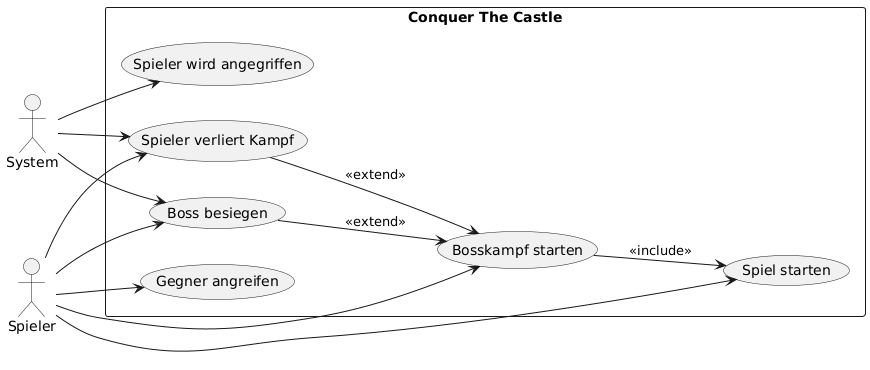

# Projekthandbuch
\textauthor{Peißl}

## Entwicklungsplan

### Projektauftrag

Diese Diplomarbeit beschäftigt sich mit der Entwicklung eines eigenständigen First-Person-Bosskampfs in der Unreal Engine 5. Das Ziel ist die Umsetzung eines vollständigen, spielbaren Szenarios, das aus einem selbst modellierten Bosscharakter, einem thematisch passenden Bossraum, den dazugehörigen Animationen sowie der notwendigen Spielmechanik besteht. Zudem gibt es am Anfang und am Ende kurze Cutscenes, um den Spieler in die Geschichte mit hinein zuziehen.

Diese Arbeit ist dadurch geprägt, dass zu Beginn keine technischen oder gestalterischen Grundlagen vorhanden sind. Weder Modelle, Animationen, Leveldesign noch Gameplay-Logik existieren. Die Herausforderung liegt darin, alle erforderlichen Komponenten – von der Modellierung über die Programmierung bis hin zur visuellen Gestaltung – eigenständig aufzubauen und zu einem funktionierenden Gesamtsystem zu verbinden.

Die Komplexität der Spielentwicklung kann man  grob in verschiedene Disziplinen aufteilen: 3D-Design, Animation, Engine-Workflow, Skripting, Soundintegration und Performanceoptimierung. Diese Fähigkeiten müssen in kurzer Zeit koordiniert werden. Gleichzeitig soll ein konsistenter visueller Stil gewahrt bleiben, und das Endprodukt muss technisch stabil und spielbar sein. Dieses Projekt bietet daher eine realitätsnahe Gelegenheit, professionelle Entwicklungsprozesse im Bereich Game Development praktisch umzusetzen.

#### Projektziele

- Erstellung eines vollständigen, funktionierenden Bosskampfes in First-Person-Perspektive  
- Modellierung eines Bosscharakters einschließlich Animationen  
- Gestaltung und Umsetzung des Bossraums im Low-Poly-Stil  
- Implementierung der Spielmechaniken (KI-Verhalten, Treffererkennung, Lebenssystem, Attacken, Kamera- und Spielersteuerung)  
- Entwicklung kurzer Cutscenes (Intro und Outro)  
- Sicherstellung eines konsistenten Designs und einer flüssigen Spielerfahrung  
- Dokumentation der technischen Entscheidungen, Workflows und Herausforderungen  

#### Nicht-Ziele bzw. nicht Inhalte

- Entwicklung eines vollständigen Spiels mit Story, mehreren Levels oder Open-World-Elementen  
- Erstellung einer komplexen Benutzeroberfläche über die nötigsten Spielmechaniken hinaus  
- Multiplayer-Funktionen oder Netzwerksynchronisation  
- Kommerzielle Veröffentlichung oder Marketing des Produktes  

#### Projektnutzen

Dieses Projekt bietet einen klaren fachlichen und pädagogischen Mehrwert. Die Umsetzung eines vollständigen Bosskampfs in der Unreal Engine 5 mit dreidimensionalen Modellen von Blender ermöglicht die verwendung von moderne Technologien, theoretisch so wie praktisch. Dadurch entsteht ein Kompetenzzuwachs in Bereichen wie 3D-Modellierung, Animation, Programmierung, Engine-Workflow und Projektorganisation – alles Fähigkeiten, die in der heutigen IT- und Medienwelt stark nachgefragt sind.

Gleichzeitig schafft das Projekt ein sichtbares, funktionierendes Endprodukt, das als Demonstrator für zukünftige Klassen und schulische Präsentationen eingesetzt werden kann. Der Nutzen liegt somit nicht nur beim Projektteam, sondern auch bei der Schule, die ein professionell wirkendes Showcase erhält. Zudem fördert das Projekt die Teamfähigkeit, das technische Problemlösen und das strukturierte Arbeiten über einen längeren Zeitraum hinweg. 

#### Projektauftraggeber/in

Diese Arbeit wurde von uns selbst vorgeschlagen und von der HTL Leoben angenommen.
Herr Prof. Kondert betreut diese Arbeit. 

Folgend sind die Kontaktdaten der HTL Leoben.

| **Feld**               | **Information**                           |
|------------------------|-------------------------------------------|
| **Name**               | HTL Leoben                                |
| **Adresse**            | Max Tendler-Straße 3, 8700 Leoben         |
| **URL**                | https://www.htl-leoben.at                 |
| **E-Mail**             | office@htl-leoben.at                      |
| **Ansprechpartner/in** | Christina Stroissnigg                     |
| **Telefon**            | +43 3842 44 888 0                         |
| **Typ**                | Fachhochschule                            |

#### Projekttermine

Hier werden die wichtigsten Termine dokumentiert.

| Termin     | Inhalt                          |
|-----------:|:--------------------------------|
| 2025-10-09 | Einreichung DA in Portal                     |
| 2025-11-12 | Ertse DA Zwischenpräsentation                    |
| 2026-01-09 | Elek. Erstversion Abgabe an Betreuer        |
| 2026-02-26 | Zweite DA Zwischenpräsentation      |
| 2026-03-06 | DA Abgabe       |
| 2026-04-07 | Biblv. DA Abgabe      |
| 2026-04-13 | DA Präsentation     | 

#### Projektkosten

Hier ist eine Übersicht, wie viel unsere Diplomarbeit vorraussichtlich kosten wird.

| Kostenname  | Kostenart | Menge  | Preis   | Gesamtkosten | Deckung durch |
|:-------------|:---------:|:------:|--------:|-------------:|---------------|
| ChatGPT Abo     | Software  |  12 |   23.00 | 276.00      | Schüler       |
| 3D Assets | Software  |  1     |  30.93 | 30.93      | Schüler|
| DA-Schreiben | Druck     |  3     |   26.00 |  53.00      | Schüler       |

__Das Projekt kostet in Summe vorraussichtlich 359,93 Euro__. 

#### Projektrisiken

Hier ist unsere einschätzug von den möglichen Risiken sowie deren Wahrscheinlichkeiten.

| Risiko                                   | EW  | Auswirkungen                                                                 | Maßnahmen |
|:----------------------------------------:|:---:|:-----------------------------------------------------------------------------|:----------|
| Unterschätzung des technischen Aufwands   | 35% | Gameplay, Animationen oder Bosslogik werden später fertig als geplant       | Frühzeitige Prototypen, klare Meilensteine, regelmäßige Reviews |
| Probleme bei 3D-Modellierung oder Rigging | 25% | Bossmodell kann nicht rechtzeitig animiert oder ins Spiel integriert werden | Vereinfachung des Modells, frühzeitige Tests in UE5, Backup-Modell |
| Unreal Engine 5 Performance-/Kompatibilitätsprobleme | 20% | Ruckeln, Crashes, hohe Nacharbeit nötig                                      | Optimierung von Anfang an, Low-Poly konsequent einsetzen |
| Zeitmanagement- oder Ressourcenprobleme im Team | 30% | Verzögerungen, ungleich verteilte Aufgaben, Qualität leidet                  | Wochenplanung, klare Verantwortlichkeiten, Transparenz im Team |
| Fehler in der Game-Logik / KI            | 20% | Bosskampf wirkt unfertig oder ist nicht spielbar                             | Iteratives Testen, isolierte Logikmodule, Debugging-Sessions |
| Verlust von Dateien / Versionskonflikte  | 10% | Arbeitsfortschritt geht verloren                                              | Regelmäßige Backups, Nutzung von GitHub, klare Branch-Struktur |
| Ausfall wichtiger Software / Hardware    | 10% | Arbeiten stoppen, Deadlines verschieben sich                                 | Redundante Geräte, Cloud-Speicher, regelmäßige Updates |
| Umfang zu groß gewählt                   | 40% | Features werden nicht fertig, Qualität leidet                                 | Feature-Cut früh definieren, Fokus auf Kernmechanik |

### Projektorganisation

#### Projektbeteiligte

Hier werden alle Beteiligten an der Diplomarbeit samt Kontaktdaten gelistet.

| Vorname     | Nachname     | Organisation | Email      |Telefonnummer      |
|:------------|:-------------|:-------------|:------------------|:------------------|
| Christina    | Stroissnigg  | HTL Leoben   | office@htl-leoben.at  |03842448880|
| Uwe    | Kondert  | HTL Leoben   | kuw@O365.htl-leoben.at  |067761128667|
| Nevio       | Peißl      | HTL Leoben     | 211witb19@o365.htl-leoben.at    |068181749849|
| Rhys         | Schmiedpeter          | HTL Leoben          | 211witb23@o365.htl-leoben.at               |06641401336|
| Elias         | Grgic          | HTL Leoben          | 211witb06@o365.htl-leoben.at               |06644643590|

#### Projektrollen

Hier werden den Kontakten von oben konkrete Rollen zuewiesen.

| Projektrolle           | Rollenbeschreibung     | Name              |
|------------------------|------------------------|-------------------|
| Projektleiter | Verantwortlicher für Einhaltung des Projektrahmens | Nevio Peißl |
| Mitarbeiter | Ist an der DA beteiligt und muss seinen Teil erledigen | Rhys Schmiedpeter |
| Mitarbeiter | Ist an der DA beteiligt und muss seinen Teil erledigen | Elias Grgic |
| Auftraggeber | Auftraggeber der internen Diplomarbeit | Christina Stroissnigg |
| Betreuer | Schulischer Betreuer | Uwe Kondert |

In dieser Grafik werden die verschienen Rollen und deren Bezihungen dargestellt.

{width=50%}

### Vorgehen bei Änderungen

Wenn sich innerhalb unserer Diplomarbeit etwas ändert, oder jemand einen Änderungsvorschlag hat muss dies zuerst mit dem Diplomarbeitsteam besprochen werden und darauf mit dem Betreuer. 
Betreuer und Teammitglieder werden darüber informiert und müssen auch dieser Änderung zustimmen. Alle Änderungen werden in der Projektdokumentation mit Datum festgehalten und ausführlich dokumentiert.

## Meilensteine

Der Begriff taucht im Projektmanagement sehr häufig auf. Meilensteine sind wichtige Punkte im Projektverlauf. Oft werden sie auch als Prüfpunkte bezeichnet.

Generell kann ein Meilenstein ein Ereignis sein, an dem

* etwas abgeschlossen ist,
* etwas begonnen wird oder
* über die weitere Vorgehensweise entschieden wird

Hier werden alle Meilensteine noch einmal mit Beschreibung aufgezählt:

### 2025-09-20: Projektvorbereitung & Projektstart

- Projekthandbuch begonnen und grundlegende Struktur festgelegt  
- Rollenverteilung innerhalb des Teams definiert  
- Projektumgebung eingerichtet (UE5, Blender, Git)  
- Erste Abstimmung über Stil, Umfang und technische Rahmenbedingungen  

### 2025-09-30: Anforderungsanalyse & Konzept

- Vollständige Beschreibung des Bossraums, Bosses und Kernspielmechaniken erstellt  
- Technisches Konzept für Animationen, KI, Leveldesign und Cutscenes ausgearbeitet  
- Risiken, Abgrenzungen und Projektziele definiert  
- Erste grobe Skizzen und Designideen dokumentiert  

### 2025-10-20: Prototyp & Grundstruktur

- Grundlegendes First-Person-Controller-System implementiert  
- Leerer Bossraum als Blockout aufgebaut  
- Pipeline für Import von 3D-Modellen getestet  
- Basislogik (Input, Bewegung, Kamera) lauffähig  

### 2025-11-11: Zwischenpräsentation

- Vorstellung des bisherigen Entwicklungsstands  
- Blockout-Bossraum, frühe Bossmodell-Version und erste Animationstests gezeigt  
- Feedback vom Betreuer eingeholt und weitere Schritte angepasst  

### 2025-11-30: Implementierung Gegner & Gamelogik

- Bossmodell vollständig fertiggestellt (inkl. Rigging und Animationen)  
- Grundlegende KI-Logiken implementiert (Bewegung, Attack-Muster, Phasenlogik)  
- Treffererkennung und Schadenssystem funktionsfähig  
- Basis für spätere Kampfmechaniken vorbereitet  

### 2025-12-20: Kampfsystem & UI

- Spielerangriffe, Block-/Ausweichmechaniken und Kollisionslogik abgeschlossen  
- UI für Lebensanzeige, Boss-Intro und Trefferfeedback implementiert  
- Kameraeffekte und visuelle Rückmeldungen integriert  
- Kampf in erster spielbarer Form funktionsfähig  

### 2025-12-30: Erstversion der Diplomarbeit

- Grobversion der schriftlichen DA erstellt  
- Alle Kapitel strukturiert und mit Platzhaltern für technische Inhalte gefüllt  
- Dokumententeile pro Teammitglied zusammengeführt  

### 2026-01-09: Feinschliff & Finale Tests

- KI-Verbesserungen, Bugfixes und Feintuning der Kampfmechaniken  
- Beleuchtung, Umgebungstexturen und Partikeleffekte finalisiert  
- Cutscenes (Intro/Outro) vollständig integriert  
- Alle Projektteile getestet und optimiert  

### 2026-02-15: Spiel abgeschlossen

- Finaler Bosskampf ist vollständig spielbar und stabil  
- Projektstände in Git sauber dokumentiert  
- Alle Deliverables abgeschlossen (Video, Screenshots, Präsentationsmaterial)  

### 2026-03-06: Endabgabe

- Diplomarbeit vollständig fertig, lektoriert und gebunden  
- Digitale Version hochgeladen  
- Evaluations- und Betreuungsprotokolle beigelegt  
- Projekt offiziell abgeschlossen  

## Anwendungsfälle

In diesem Kapitel werden die Anwendungsfälle der Diplomarbeit beschrieben. Ein Anwendungsfall stellt ein Ziel dar, das ein Akteur mithilfe des Systems erreichen möchte. Die Beschreibung erfolgt auf fachlicher Ebene und unabhängig von der technischen Implementierung. Die Anwendungsfälle sind aus Sicht der Akteure formuliert und orientieren sich an typischen Benutzerzielen innerhalb des Spiels.

Zur besseren Übersicht werden die wichtigsten Akteure und deren Interaktionen mit dem System in einer Anwendungsfallübersicht dargestellt.

### Akteure

- **Spieler**  
  Person, die das Spiel startet und den Bosskampf aktiv spielt.

- **System**  
  Das Spiel selbst (Unreal Engine 5), welches Spielzustände verwaltet, Logiken ausführt und Cutscenes abspielt.

Jeder Anwendungsfall wird im selben Muster beschrieben. In den folgenden Absätzen ist zuerst eine allgemeine Beschreibung eines solchen Anwendungsfalls zu finden und dann ein Beispiel dazu.

Damit es übersichtlicher ist gibt es hier noch eine Übersichtsgrafik:

{width=60%}

\newpage
### Spiel starten

**Kurzbeschreibung**  
Der Spieler startet das Spiel und wird in die Spielwelt geladen.

**Trigger**  
Der Spieler startet das Spiel über die ausführbare Datei.

**Vorbedingung**  
Die ausführbare Datei befindet sich auf dem Rechner.

**Nachbedingung**  
Der Spieler befindet sich im Spiel und die Startsequenz beginnt.

**Akteure**  
Spieler

**Standardablauf**  
1. Der Spieler startet das Spiel.  
2. Das System lädt die benötigten Ressourcen.  
3. Eine Intro-Cutscene wird abgespielt oder übersprungen.  
4. Der Spieler wird in den Bossraum versetzt.

**Fehlersituationen**  
- Spiel kann nicht gestartet werden.

**Systemzustand im Fehlerfall**  
Das Spiel wird beendet, es findet kein Übergang in die Spielwelt statt.

/newpage
### Bosskampf starten

**Kurzbeschreibung**  
Der Spieler beginnt den Bosskampf nach Betreten des Bossraums.

**Trigger**  
Der Spieler erreicht den definierten Startpunkt im Bossraum.

**Vorbedingung**  
Das Spiel wurde erfolgreich gestartet.

**Nachbedingung**  
Der Bosskampf ist aktiv und der Boss greift den Spieler an.

**Akteure**  
Spieler, System

**Standardablauf**  
1. Der Spieler betritt den Bossraum.  
2. Das System aktiviert den Boss.  
3. Die Boss-Intro-Sequenz wird ausgelöst.  
4. Der Bosskampf beginnt.

**Fehlersituationen**  
- Boss kann nicht initialisiert werden.

**Systemzustand im Fehlerfall**  
Der Kampf startet nicht, der Spieler bleibt im Bossraum ohne aktive Gegner.

/newpage
### Gegner angreifen

**Kurzbeschreibung**  
Der Spieler greift den Boss mit einer Waffe an.

**Trigger**  
Der Spieler löst einen Angriff aus.

**Vorbedingung**  
Der Bosskampf ist aktiv.

**Nachbedingung**  
Der Boss erleidet Schaden oder blockiert den Angriff.

**Akteure**  
Spieler, System

**Standardablauf**  
1. Der Spieler führt einen Angriff aus.  
2. Das System prüft die Treffererkennung.  
3. Schaden wird berechnet und angewendet.  

**Fehlersituationen**  
- Angriff verfehlt den Boss.

**Systemzustand im Fehlerfall**  
Der Boss erleidet keinen Schaden, der Kampf läuft weiter.

/newpage
### Spieler wird angegriffen

**Kurzbeschreibung**  
Der Boss greift den Spieler an.

**Trigger**  
Der Boss führt eine Angriffshandlung aus.

**Vorbedingung**  
Der Bosskampf ist aktiv.

**Nachbedingung**  
Der Spieler verliert Lebenspunkte oder weicht erfolgreich aus.

**Akteure**  
Spieler, System

**Standardablauf**  
1. Der Boss startet eine Attacke.  
2. Das System prüft Treffer oder Ausweichmanöver.  
3. Schaden wird gegebenenfalls angewendet.

**Fehlersituationen**  
- Spieler befindet sich außerhalb der Reichweite.

**Systemzustand im Fehlerfall**  
Der Spieler erleidet keinen Schaden.

/newpage
### Boss besiegen

**Kurzbeschreibung**  
Der Spieler besiegt den Boss durch Reduzierung dessen Lebenspunkte auf null.

**Trigger**  
Die Lebenspunkte des Bosses erreichen null.

**Vorbedingung**  
Der Bosskampf ist aktiv.

**Nachbedingung**  
Der Bosskampf ist beendet und das Spiel endet.

**Akteure**  
Spieler, System

**Standardablauf**  
1. Der Spieler fügt dem Boss den finalen Schaden zu.  
2. Das System beendet den Kampf.  
3. Eine Abschluss-Cutscene wird abgespielt.  

**Fehlersituationen**  
Keine.

**Systemzustand im Fehlerfall**  
Nicht zutreffend.

/newpage
### Spieler verliert den Kampf

**Kurzbeschreibung**  
Der Spieler verliert den Bosskampf durch Verlust aller Lebenspunkte.

**Trigger**  
Die Lebenspunkte des Spielers erreichen null.

**Vorbedingung**  
Der Bosskampf ist aktiv.

**Nachbedingung**  
Der Kampf endet und das Spiel wird beendet oder neu gestartet.

**Akteure**  
Spieler, System

**Standardablauf**  
1. Der Spieler erleidet tödlichen Schaden.  
2. Das System beendet den Bosskampf.  
3. Eine Niederlagen-Sequenz wird angezeigt.

**Fehlersituationen**  
Keine.

**Systemzustand im Fehlerfall**  
Nicht zutreffend.

